

The primary mission of the R Consortium is to develop and implement infrastructure projects to support 
the R community. The R Community embraces principles of openness and collaboration as defined in our [Code of Conduct](/codeofconduct.qmd).

## Board of Directors

The business of the foundation is managed by its Board of Directors, composed of appointed Platinum 
members of the R Consortium, annually elected Silver members of the R Consortium, and the ISC appointed 
director as [defined in the ByLaws](/rc-docs/R-Consortium-Bylaws-7-9-2024.pdf) (PDF).

<h2>Mike K Smith, Pfizer</h2>

Chair, Silver Member Representative

Mike K Smith, Lead, R Centre of Excellence and Senior Director Statistics at Pfizer. Mike is a 
professional geek, helping colleagues from the business lines understand the power of reproducibility, 
automation and writing good code and helping the IT department understand the needs of the business 
lines. He is passionate about driving business outcomes through primary research, data and alternative 
data solutions as well as statistical analysis.

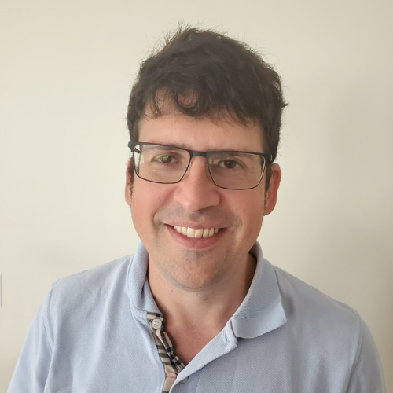
<h2>Michael Lawrence, R Foundation</h2>

R Foundation Representative

Michael is a scientist in the Bioinformatics and Computational Biology department at Genentech 
Research and Early Development (gRED), based in South San Francisco, CA. There he leads the development 
of tools, applications and environments for analyzing genomic data using R and Bioconductor. His 
research interests are in visualization, software interfacing, and genomic data manipulation. Michael 
is a member of the Bioconductor Technical Advisory Board, the R Core team, and the R Foundation Board.

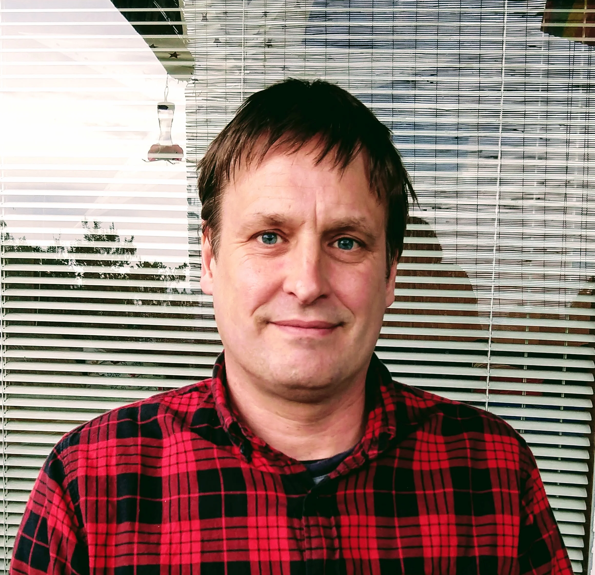
<h2>Henrik Bengtsson, R Foundation</h2>

R Foundation Representative, ISC Director

Henrik Bengtsson is an Associated Professor at University of California, San Francisco, a member 
of the R Foundation, with a background in Computer Science and Mathematical Statistics. He has used 
R since 2000 for applied research in statistics and bioinformatics. He develops statistical methods, 
scientific computational software, and programming tools. His work includes R packages for science 
(e.g. matrixStats, and PSCBS, aroma.affymetrix) and software development (e.g. future, profmem, 
startup, and R.rsp).

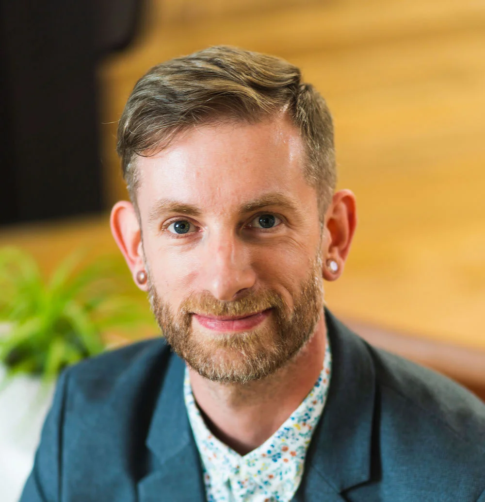
<h2>Hadley Wickham, Posit</h2>

Platinum Member

Hadley is Chief Scientist at RStudio, a member of the R Foundation, and Adjunct Professor at 
Stanford University and the University of Auckland. He builds tools (both computational and cognitive) 
to make data science easier, faster, and more fun. His work includes packages for data science 
(the tidyverse: including ggplot2, dplyr, tidyr, purrr, and readr) and principled software development 
(roxygen2, testthat, devtools). He is also a writer, educator, and speaker promoting the use of R 
for data science. Learn more on his website, http://hadley.nz.

<h2>Benjamin Arancibia, GSK</h2>

Silver Member Representative

Benjamin Arancibia, Director of Data Science, focuses on enabling the use of R in GSK Biostatistics. 
He builds tools to make data science fun, reproducible, and helps advocate for the use of R in the 
department. Ben is passionate about making sure that teams have the right support when using R in 
production analyses and helping teams learn while delivering. He is an advocate of R and open source 
technologies internally at GSK and externally speaking about lived experiences at various conferences.

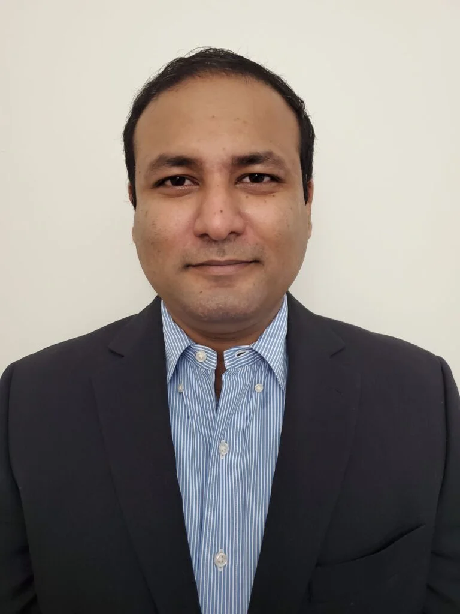
<h2>Uday Preetham Palukuru, Merck</h2>

Silver Member Representative

Uday Preetham Palukuru is a Standards lead at Merck &Co., providing leadership to develop and maintain 
global standards for ADaM implementation, R package development, Open Source package qualification, 
Computing Platform enhancements and compliance management tools. He has contributed to various internal 
and external R packages and is a member of the R Validation Hub Executive committee. He actively promotes 
the use of open source software in clinical trial data analysis via forums and paper publications. He 
has a PhD in Bioengineering from Temple University.

## Infrastructure Steering Committee

An Infrastructure Steering Committee (ISC) is responsible for the identification, selection, 
and oversight of <a href="/all-projects">infrastructure projects</a>, as well as directing best practices and 
community leadership within the R community. Voting representatives are appointed by the Platinum 
and Silver members of the R Consortium, as well as an elected member from the Silver membership 
class and the project leads for all Top Level Projects as directed in 
the <a href="/rc-docs/ISC-Charter-08-13-24.pdf">ISC Charter</a> (PDF).

<h2>Henrik Bengtsson, R Foundation</h2>

ISC Director, R Foundation Representative

Henrik Bengtsson is an Associated Professor at University of California, San Francisco, a member 
of the R Foundation, with a background in Computer Science and Mathematical Statistics.

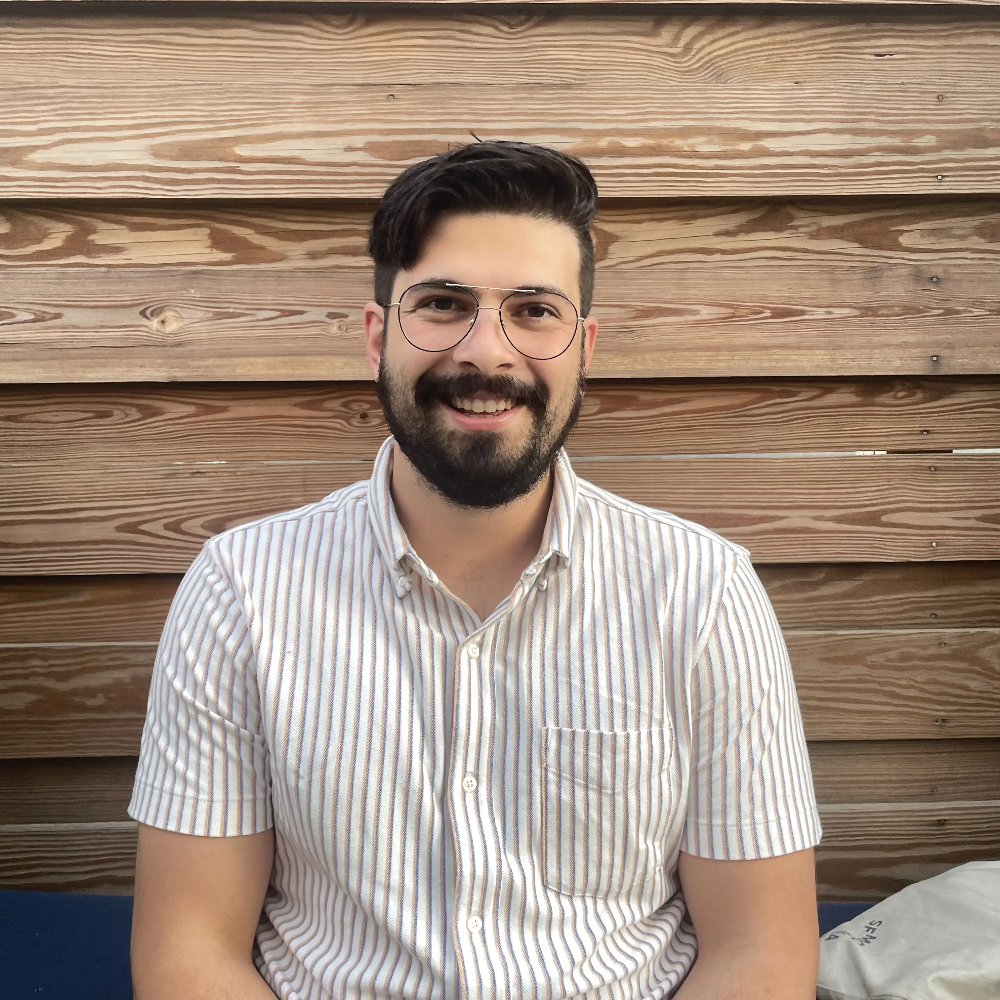
<h2>Josiah Parry, Esri</h2>

ISC Vice Chair, Silver Member Representative

Josiah Parry is a Senior Product Engineer in Spatial Analysis and Data Science at Esri. He leads the R-ArcGIS Bridge project, bringing the ArcGIS system to the R community. A contributor to the extendr library, Josiah specializes in bridging R and Rust and is a package developer focused on building fast, scalable tools. 

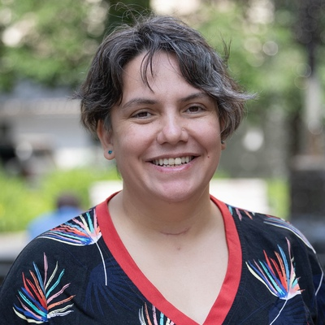
<h2>Yanina Bellini Saibene, rOpenSci, R-Ladies, Universidad Austral</h2>

Yanina Bellini Saibene is the Community Manager at rOpenSci and co-founder of LatinR. She serves on the Boards of The Carpentries and R-Ladies, and teaches at Universidad Austral. A GitHub Star (2022–2025), Yanina has received multiple national awards for her work in open data and digital agriculture.

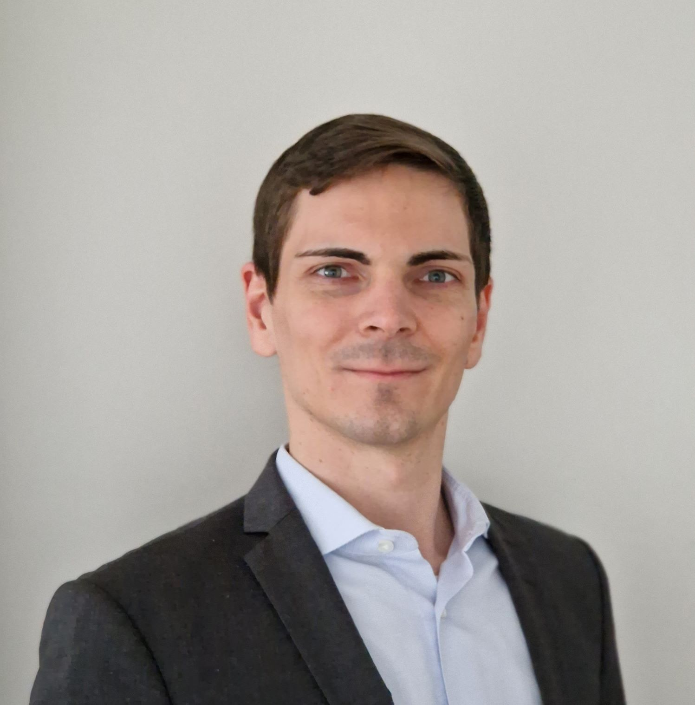
<h2>Benedikt Schamberger, Swiss Re</h2>

Silver Member

Benedikt leads actuarial AI & Technology consulting at Swiss Re, helping teams adopt R and open-source tools. He also leads a Posit-based internal analytics platform used by hundreds company-wide. He supports the R community by promoting best practices and delivering trainings for insurance and other financial professionals. He holds a MSc in mathematical finance and actuarial science from Technical University Munich.

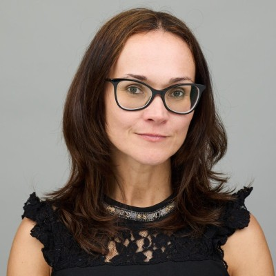
<h2>Daniela Colombo, Microsoft</h2>

Platinum Member

Daniela Colombo is EMEA Enterprise Partner CTO and Sr. Director of Technology 
at Microsoft with in depth experience and knowledge about Data & AI and Applications.

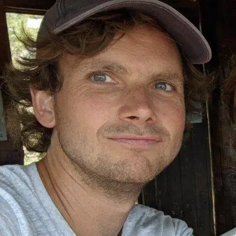
<h2>Jeroen Ooms, rOpenSci</h2>

Jeroen Ooms is the Lead Infrastructure Engineer at rOpenSci and creator of the R-universe platform. He is also a member of the Tidyverse team and maintains some of the most widely used R packages. Jeroen has PhD in statistics from UCLA and spent 10 years as a postdoc and research engineer at UC Berkeley.

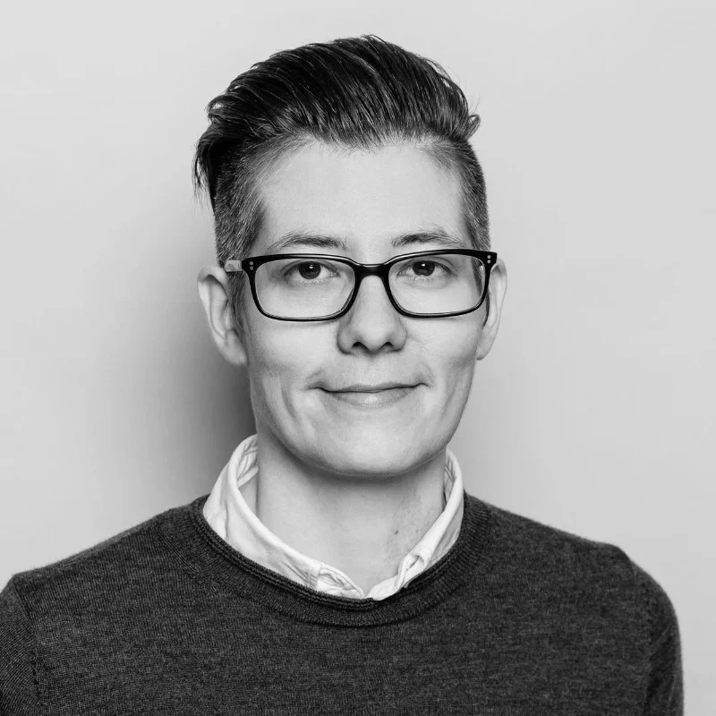
<h2>Hannah Frick, Posit</h2>

Platinum Member

Software engineer on the tidymodels team at Posit. Co-founder of R-Ladies Global and former 
co-organiser of the London chapter. 

<h2>Kirill Müller, R-DBI, Top-Level Project</h2>

Kirill runs the DBI project, a top-level project at the R Consortium, has previously been awarded five other projects, and is a core contributor to several tidyverse packages, including duckplyr, dplyr, and tibble. He is a founder and partner at cynkra, a data science consultancy based in Zurich.

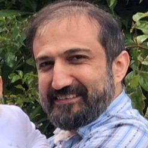
<h2>Peyman Eshghi, Johnson & Johnson</h2>

Silver Member

Senior Principal Technical Lead at Johnson & Johnson, with years of experience in R and data science, dedicated to advancing R in regulated industries by promoting robust, reproducible tooling, community collaboration, and best practices in package development and visualization.

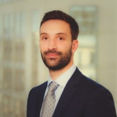
<h2>Nikolas Kountouris, Pfizer</h2>

Silver Member

Nikolas is a professional with a proven track record of successfully delivering projects and leading teams in the banking, consulting, technology and pharmaceutical sectors. He has worked in different environments and countries and has extensive experience in data science, data analytics and risk management (ICAAP, IFRS 9 and IRB).

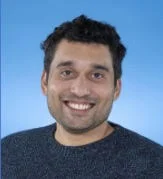
<h2>James Black, Novartis</h2>

Silver Member

Hello my name is James &#128075;. I'm a father, kiwi, husband, code tinkerer and technical leader. I started my career in epidemiology and now work to improve our ability to understand and leverage data to improve human health.

## Leadership
As a [project operating within the Linux Foundation](http://collabprojects.linuxfoundation.org), the 
project staff from the Linux Foundation focuses on project growth and health, ensuring a vendor-neutral 
environment for collaboration.

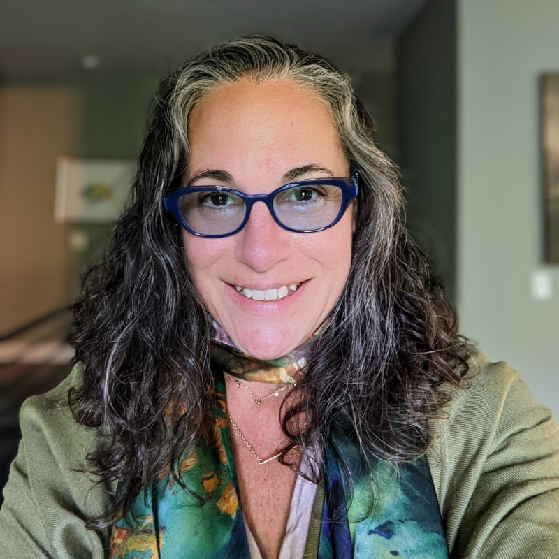
<h2>Terry Christiani</h2>

Executive Director

30 years of building content strategies to help companies acquire and 
support customers. Successfully rebranded and created content programs 
to help build and sell 4 different companies. Built programs to identify 
and remedy content management issues affecting content performance. 
Managed outreach programs to open source communities through digital, 
hybrid, and IRL events.

