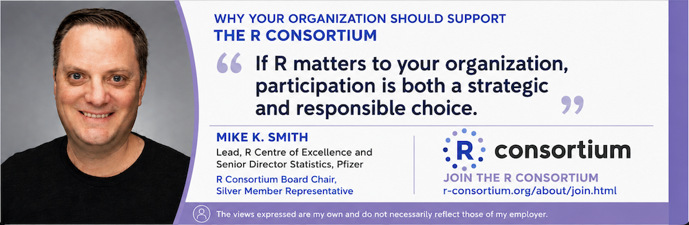
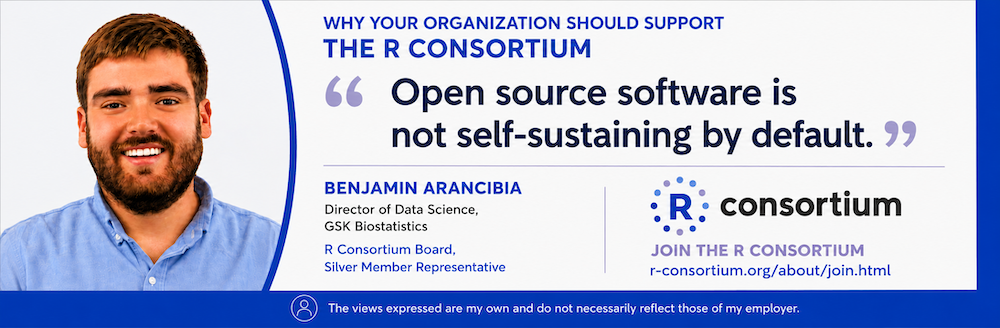

## Invest in the Future of R

R is critical open-source infrastructure for statistics, data science, research, and production applications worldwide. Its long-term health depends on organizations investing in the people, infrastructure, and community that sustain it.

**R Consortium membership gives organizations that rely on R a direct way to support its future while participating in the ecosystem.**

Member support helps strengthen technical infrastructure, contributor development, working groups, community programs, and initiatives that keep R reliable, relevant, and sustainable.

::: {.effective-note}
The 2027 R Consortium membership program is effective January 1, 2027.
:::

{fig-alt="Quote from Mike Smith, R Consortium Board Chair"}

## Why Membership Matters

Organizations that use R benefit from a global open-source ecosystem. Membership provides a way to help sustain that ecosystem while engaging with the organizations and people shaping its future.

R Consortium members help support:

- **R sustainability and infrastructure**
- **Reliability, reproducibility, validation, and production readiness**
- **Technical grants and collaborative projects**
- **Contributor recruitment and mentorship**
- **Industry engagement and shared problem-solving**
- **Education, events, and community development**

The R Consortium provides a neutral forum where companies, institutions, the R Foundation, and the broader R community can collaborate on shared priorities.

## 2027 Membership Options

::: {.membership-grid}

::: {.membership-card}
### Premier

$100,000 annually

For organizations seeking the highest level of participation in R Consortium governance and activities.

Premier Members receive:

- One designated voting seat on the R Consortium Board of Directors
- Voting representation in the Infrastructure Steering Committee, subject to ISC governance
- Participation in member and industry forums
- Three complimentary registrations per R Consortium event
- Logo recognition on the R Consortium website
- Access to working groups, programs, events, and member initiatives
:::

::: {.membership-card}
### Core

$35,000 annually - 100 or more FTEs

$12,500 annually - Fewer than 100 FTEs

For organizations that rely on R and want to support the ecosystem while participating in Consortium governance and activities.

Core Members receive:

- The right to nominate and elect voting Core Directors
- One elected Core Director for every two Core Members
- Eligibility for ISC representation, subject to ISC governance
- Participation in member and industry forums
- Three complimentary registrations per R Consortium event
- Logo recognition on the R Consortium website
- Access to working groups, programs, events, and member initiatives
:::

::: {.membership-card}
### Associate

$10,000 annually

For eligible nonprofit organizations and academic institutions.

Associate Members receive:

- The right to nominate and elect Associate Board Observers
- One non-voting Board Observer for every two Associate Members
- Non-voting ISC participation, subject to ISC governance
- Participation in appropriate member, academic, and nonprofit forums
- Three complimentary registrations per R Consortium event
- Logo recognition on the R Consortium website
- Opportunities to highlight relevant work through R Consortium channels
- Access to working groups, programs, events, and member initiatives
:::

:::

## Compare Membership

::: {.compare-wrap}

| Benefit | Premier | Core | Associate |
|:----|:----|:----|:----|
| Annual dues | $100,000 | $35,000 / $12,500 | $10,000 |
| Eligibility | Organizations | Organizations | Nonprofits & academic institutions |
| Board participation | Designated voting Director | Elect voting Directors | Elect non-voting Observers |
| Representation formula | 1 per Premier Member | 1 per 2 Core Members | 1 per 2 Associate Members |
| ISC participation | Voting | Eligible for representation | Non-voting |
| Member / industry forums | ✓ | ✓ | ✓ |
| 3 complimentary event registrations | ✓ | ✓ | ✓ |
| Website recognition | ✓ | ✓ | ✓ |
| Working groups & member activities | ✓ | ✓ | ✓ |

:::

## More Than Sponsorship

Membership is an opportunity to participate.

Members contribute expertise, industry experience, and organizational resources to programs addressing shared challenges across the R ecosystem.

Participation can include working groups, industry roundtables, technical initiatives, community programs, conferences, workshops, and other R Consortium activities.

You do not need to serve on the Board to make membership valuable. Organizations can involve subject-matter experts from across their teams in the work most relevant to them.

{fig-alt="Quote from Ben Arancibia, R Consortium Board Member"}

## Ready to Join?

1. Review the R Consortium Bylaws, Membership Agreement, and membership information.

    - [R Consortium Membership Datasheet](../rc-docs/r_consortium_datasheet.pdf) (PDF)
    - R Consortium Bylaws (PDF)
    - [R Consortium Membership Agreement](../rc-docs/R-Consortium-Membership-Agreement-1157181-v2-Approved-11.20.19.pdf) (PDF)
    - [R Consortium – Certificate of Incorporation](../rc-docs/R-Consortium-Certificate-of-Incorporation.pdf) (PDF)

2. Select the membership level that fits your organization.

3. Complete the [membership application](https://join.r-consortium.org/) and agreement.

4. Join the programs, working groups, and activities that matter to your organization.

::: {.join-cta}
[Apply for Membership](https://join.r-consortium.org/)
:::

## Have Questions?

Want to discuss which membership level is right for your organization or how your team could participate?

::: {.join-cta}
[Talk to Us About Membership](https://members.r-consortium.org/){.secondary}
:::
