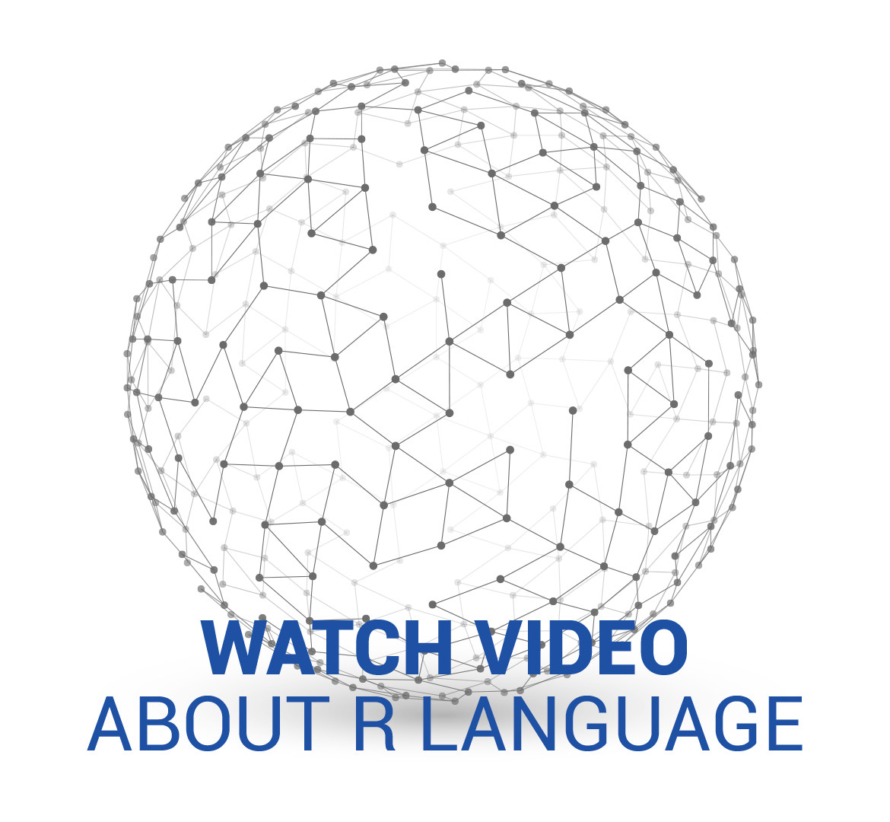

---
listing:
  contents: posts
  exclude: 
    unpublished: true
  sort: "date desc"
  type: grid
  max-items: 6
page-layout: full
format: html
---
<link rel="stylesheet" href="https://cdnjs.cloudflare.com/ajax/libs/Swiper/4.3.3/css/swiper.css">

<!-- swiper slides -->

Call for Proposals is open now!

<button class="mustardButton"><a href="https://rconsortium.github.io/RplusAI_website/cfp.html" style="text-decoration: none;">Submit your proposal now!</a></button>

Submit now! Deadline is September 7!

<h2>R User Group Program and Small Conference Funding Program now accepting applications Partner with us to support your meetup or local event.</h2>
<button class="blueButton"><a href="all-projects/rugsprogram.qmd" style="text-decoration: none;">LEARN MORE</a></button>

<h2>Find your local R user group Network with fellow statisticians and learn from your peers. </h2>
<button class="blueButton"><a href="https://www.meetup.com/pro/r-user-groups/" style="text-decoration: none;">FIND A USER GROUP</a></button>

<h2>R Consortium: Supporting the R community, the R Foundation and organizations developing, maintaining and distributing R software.
</h2>

<h2>Find your local R user group Network with fellow statisticians and learn from your peers. </h2>
<button class="blueButton"><a href="all-projects/rugsprogram.qmd" style="text-decoration: none;">LEARN MORE</a></button>

<!-- !swiper slides -->

<!-- next / prev arrows -->

<!-- !next / prev arrows -->

<!-- pagination dots -->

<!-- !pagination dots -->

<section class="what-is-r-section" id="what-is-r">
  

  

  

  <a class="scroll-title-link" href="about/index.qmd">
  <h2 class="scroll-title">WHAT IS THE R CONSORTIUM?</h2>
  </a>
  <a class="scroll-title-link" href="about/governance.qmd">
  <h2 class="scroll-title">GOVERNANCE</h2>
  </a>
  

  
The central mission of the R Consortium is to work with and provide support to the R Foundation and to the key organizations developing, maintaining, distributing and using R software through the identification, development and implementation of infrastructure projects.

  
The R language is an open source environment for statistical computing and graphics, and runs on a wide variety of computing platforms. The R language has enjoyed significant growth, and now supports over 2 million users. A broad range of industries have adopted the R language, including biotech, finance, research and high technology industries. The R language is often integrated into third party analysis, visualization and reporting applications.

  

  

  
  

  

</section>

<section class="joining-r-section" id="joining-r">
<a class="scroll-title-link" href="about/join.qmd">
<h2 class="scroll-title" style="border:none;">Joining R Consortium</h2>
</a>

Industry-leading organizations have joined the R Consortium to support an open source governance and foundation model to provide support to the R community, the R Foundation and groups and individuals, using, maintaining and distributing R software.

</section>

<section class="need-help-section" id="need-help">
<a class="need-help-heading-link" href="https://members.r-consortium.org/">
<h2 class="scroll-title">Need Help?</h2>
</a>

If you need help such as with billing, mailing lists or otherwise then please use this service desk for support.

</section>

<section id="latest-news">
<h2 class="scroll-title">BLOG</h2>
</section>

