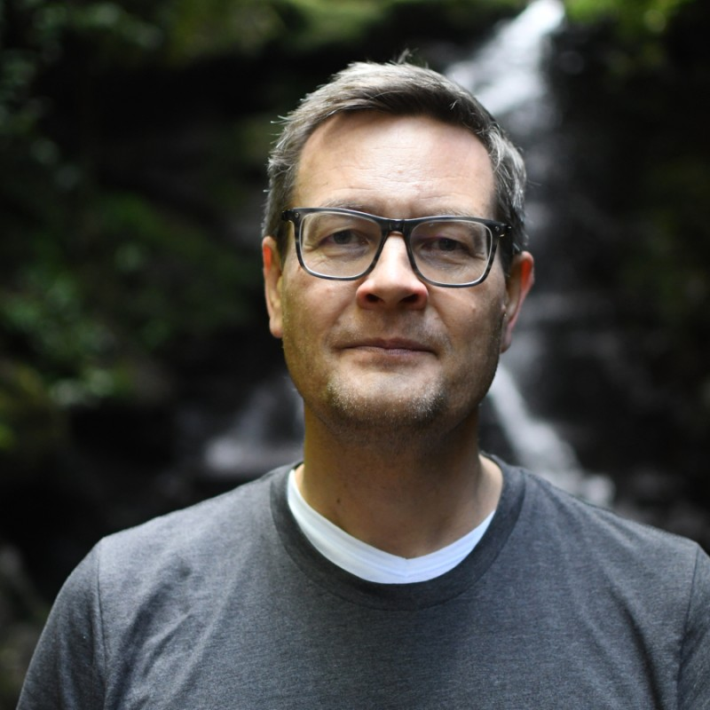
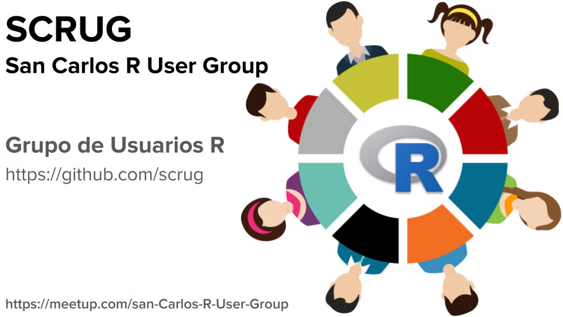

[Frans van Dunné](https://www.linkedin.com/in/fransvandunne/), organizer of the [San Carlos R User Group](https://scrug.github.io/) (also on [Meetup](https://www.meetup.com/es-ES/san-carlos-r-user-group/?eventOrigin=home_groups_you_organize)) in San Carlos, Costa Rica, recently reconnected with the R Consortium to discuss the evolution of the community he has been building over the past decade. He shared how the group grew from small local meetups in a mountain town into online events that attracted participants from across Costa Rica and the wider Latin American region. Frans discussed some of the group’s most memorable events, the realities of sustaining engagement in a long-running user group, the continued momentum behind the DataLatam podcast, and his perspective on how R adoption has changed across academia and industry over the years.

\{width="50%"}

## How has the group been doing since we last talked in [September 2024](https://r-consortium.org/posts/conectaR-podcasts-and-datathons-san-carlos-r-user-group-in-costa-rica/)?

The group has been struggling a bit to keep things going. I just had the first session of the year yesterday, and I noticed that the number of people showing up is declining. I’m not sure why that is; it might have something to do with Meetup. I wonder how other groups are faring. We started with the first session, and I’m open to seeing how things progress, but it hasn’t been easy. 

On the other hand, the [DataLatam Podcast](https://www.datalatam.com/) is easier to manage because there’s more momentum behind it. We continue to be very active with the podcast, and we’re considering organizing a DataLatam event that could potentially include more languages. It’s something we’re thinking about because it would be fun.

\

## What has your 10-year experience of organizing the San Carlos R User Group been like? Which group events stand out as your favorites?

The most successful event we had was when we maxed out Zoom with over a hundred participants. I could only accommodate a hundred, and there were still more people trying to join. This event featured a talk by [Magdiel Ablan](https://www.linkedin.com/in/magdiel-ablan-bortone-bb279973/?locale=en_US), where she discussed how to analyze Twitter feeds using R. It was many years ago, and I can’t recall the exact year, but I remember it as one of our most successful events.

I began this journey in a small town called San Carlos, nestled in the mountains of Costa Rica. Initially, I struggled to find a venue and to gather people. At one point, individuals started traveling from San José, taking a three-hour bus ride—sometimes even longer due to traffic—to attend our evening meetings. When I realized this, I thought it was crazy. That’s when I decided to move our meetings online. This transition allowed people from San José to participate, while still keeping it very much focused on Costa Rica.

Interestingly, I soon began attracting participants from remote regions in Peru and other parts of Latin America that I had never heard of. Since the events were conducted in Spanish, it turned out to be a lot of fun. This arrangement worked well until Meetup sent me a message stating that, because I was hosting online events, they would close my account since Meetup was designed for in-person gatherings. This happened before the pandemic, leaving me in a difficult position. Organizing in-person events required more effort and had less reach, and this requirement really slowed down the progress of the user group.

Then the pandemic hit, and Meetup started to promote online meetings. However, by that time, we had lost some momentum, though I did manage to start up again. For several years, I held monthly events, and December always posed a question: What should I do that month? I remembered how it felt to be alone during Christmas, so I decided to continue organizing meetings. Surprisingly, there were always people who joined, making those gatherings special and intimate. I eventually stopped doing that a few years ago, but those meetings remain a highlight in my memory.

For the past two years, I’ve had an idea for an event aimed at young people—specifically those in their teens and twenties—a sort of new-generation initiative. I want to focus on statistical programming and machine learning at a very basic level. Hopefully, that will be something we can organize in 2026. 

## The Data Latam podcast is impressive, boasting 124 episodes. How do you maintain this consistency over ten years, and how do you source your guests?

First of all, Diego - the co-host of the podcast - and I have found that having a podcast is a great way to connect with people we want to speak with: we invite them to our podcast. Typically, people don’t say no to such an invitation. Additionally, sometimes we meet interesting individuals and think, "We’d like to hear more from them." So, the podcast serves as an excuse to dive deeper into conversations with fascinating people. We record these discussions and share them as episodes. This is why we have been able to continue the podcast for so long; it’s not a burden—it's genuinely enjoyable.

About ten years ago, I set up a very basic Lector CMS website, which you can still see today. Over the years, I have refined a process that I’ve completed more than 100 times. Now, it only takes me a few clicks to get things done. I also have someone on my team who helps edit the audio, making the whole process much faster.

Are you interested in the tools we use? Great! We record using [Zoom](https://www.zoom.com/), which has introduced a fantastic new feature that allows separate recordings for each speaker. This has significantly improved our audio quality. However, you need to enable this option; when you do, you’ll receive separate audio streams for each participant. Just keep in mind that you must manually select and download them separately, as they are not included in the automatic download.

For editing, I use a digital audio workstation called [Reaper](https://www.reaper.fm/). While the name may sound a bit ominous, it’s a wonderful program that I’ve used for quite some time. I import the different audio tracks, mix them, and polish the sound by removing gaps and filler words like "uh" and "um." If a speaker accidentally says something they shouldn’t have, I edit that out as well. Once the editing is complete, I convert the audio to MP3 format and upload it to the website.

On the website, we have configured the XML in the Apple Podcast format. This XML is crucial as it allows us to distribute the podcast across various platforms like Apple Podcasts and Spotify. 

## 

## You may have noticed a shift in the R community and how R is accepted and used over the past 10 years. How has its adoption changed in industry and academia?

There are many layers to that question, so whatever I say may not represent the complete truth. Every answer I give will carry some bias. 

When it comes to the adoption of R in academia, particularly in Latin America, there has been a significant surge over the past 10 years. When I arrived in Costa Rica, the predominant tools were still SAS and SPSS, and some professors were resistant to incorporating R into their work. However, that battle has now been won; most universities can no longer afford the luxury of paying for those licenses, and even when they receive them for free, it sometimes becomes a challenge to distinguish between purely data engineering tasks—where SQL and Python are quite relevant—and advanced analytics, where R is often more effective and expressive.

Since I started using R in 2002, I’ve seen a world of difference. I made my first donation to the R Foundation that same year or soon after. Over the past decade, I have seen many enthusiastic individuals, young and not-so-young creating innovative and beautiful projects in the R community. This vibrant activity continues, and it’s heartening to see.

In our work at [ixpantia,](https://www.ixpantia.com/en/) we still undertake projects using R. We have clients who are focused on R, and we often begin with it. As our projects scale, we sometimes shift towards implementing more [Rust](https://rust-lang.org/) in our toolchain instead of C, as Rust is very fast and shares some similarities with R. This connection makes it easier to transition between the two languages. My knowledge and experience with R have greatly prepared me to work with Rust, and I find that the two languages' flow complements each other very well, making them a powerful combination.

## How do I Build an R User Group?

R Consortium’s R User Group and Small Conference Support Program (RUGS) provides grants to help R groups organize, share information, and support each other worldwide. We have given grants over the past four years, encompassing over 82,000 members in almost 100 user groups in 41 countries. We would like to include you! Cash grants and meetup.com accounts are awarded based on the intended use of the funds and the amount of money available to distribute

<https://r-consortium.org/all-projects/rugsprogram.html>
