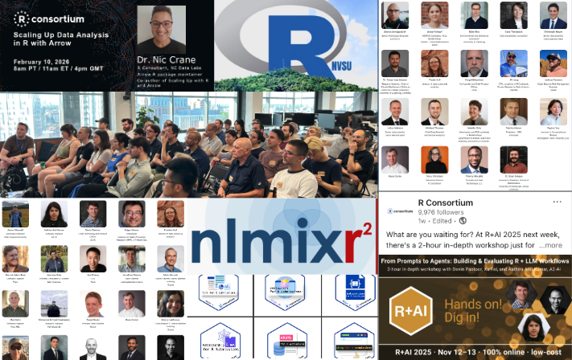

As we move through 2026, the R Consortium continues its social infrastructure mission to support and grow the global R community. The first quarter of the year has been marked by continued growth in technical collaboration, community engagement, and events that bring R users together to share ideas and innovation.

Investments from the [Sovereign Tech Fund](https://r-consortium.org/posts/sovereign-tech-fund-invests-450000-in-r-foundation-to-enhance-r-sustainability-and-security/) and the [Research Software Maintenance Fund](https://www.software.ac.uk/ssi-awards-funding-13-critical-projects-through-research-software-maintenance-fund-round-1) in the R Foundation are underwriting significant progress in R’s sustainability and security through infrastructure modernization, active mentorship of the next generation of R Core, and increased engagement with the community. 

At the R Consortium, one of our roles is to help sustain and strengthen the ecosystem that supports R. That means supporting open technical work through our Infrastructure Steering Committee (ISC) grants, enabling grassroots community growth through R User Group (RUG) micro-grants, supporting R-Ladies promote gender diversity in the R community, and hosting multi-day events and webinars where practitioners can exchange knowledge and showcase how R is used to solve real problems.

Together, these efforts reinforce a central goal: ensuring that R remains a vibrant, collaborative environment for statistical computing, data science, and applied analytics across industries.

## Structured for the R Community

I have focused my efforts as executive director in building a sustainable, annual platform for community events. These events provide a collegial and relevant venue for practitioners to share research, demonstrate applications, and discuss emerging trends across the R ecosystem.

The R Consortium now annually hosts three flagship events:

* R/Medicine, which brings together experts applying R in healthcare, clinical research, and biomedical data analysis  
* R+AI, focused on the growing intersection of R with artificial intelligence and machine learning  
* R\!sk, highlighting applications of R in financial risk, modeling, and quantitative analysis

R/Medicine has grown into an important forum for knowledge exchange within its domain. Our inaugural R+AI and R\!sk events focused on specific application areas, and provided the opportunity formeaningful discussions among practitioners facing similar challenges.

At the same time, they connect participants to the broader R community, across specialities and industries.

In addition to these hosted events, the R Consortium continues to sponsor useR\!, the long-standing global conference for the R community. While useR\! is organized independently, sponsorship helps support the conference and ensures that it remains accessible to the global R community.

Together, these events create a structured platform for engagement across the ecosystem. The events help tell the stories of how R is used in practice \- from clinical trials and financial modeling to AI workflows and reproducible research.

## Supporting the Technical Foundation of R

One of the R Consortium’s most important responsibilities is supporting technical projects that benefit the broader R ecosystem. Through the ISC grants program and working groups, the Consortium helps fund and coordinate work that improves infrastructure, tooling, and long-term sustainability.

ISC working groups bring together experts from multiple organizations to tackle challenges that benefit the entire community. These collaborative efforts lead to improvements that ripple across the entire ecosystem. From package infrastructure and interoperability to tools that make R more reliable in production and regulatory environments.

At the end of 2025, the R Consortium announced eight newly funded ISC technical projects, continuing our investment in strengthening and modernizing the infrastructure that supports the global R ecosystem. These projects represent ongoing renewal and improvement of core capabilities across developer tooling, reproducible workflows, internationalization, and data infrastructure. Highlights include rw, a CLI for webR with sandboxing features; rextendr, supporting scientific computing development with Rust and R; birdnetTools 2.0, linking BirdNET outputs to occupancy modeling in R; and extendr, advancing modern object-oriented programming tools for R.

Additional projects focus on ecosystem-wide improvements, including a consistent translations glossary for R, version-controlled reproducible workflows, efforts to modernize R’s web-mapping capabilities, and translating the *Causal Inference for the Brave and True* book to R. Together, these initiatives demonstrate the R Consortium’s ongoing commitment to strengthening the technical foundations that help the R community innovate and collaborate. 

The full list of funded projects is available here:  
[https://r-consortium.org/all-projects/funded-projects.html](https://r-consortium.org/all-projects/funded-projects.html)

For organizations that rely on R but may not yet be ready to become members of the R Consortium, participating in a working group is often the best first step. It allows teams to collaborate directly with other R practitioners, help shape technical priorities, and contribute to solutions that strengthen the ecosystem.

You can explore the current working groups here:  
[https://r-consortium.org/all-projects/isc-working-groups.html](https://r-consortium.org/all-projects/isc-working-groups.html)

## Grassroots Growth Through R-Ladies and R User Groups

While technical work strengthens the infrastructure of R, community engagement helps the education ecosystem continue to grow and builds bridges to industry. The R Consortium has long supported this grassroots layer of the community through programs such as R-Ladies+, a Top-Level Project at the R Consortium, that promotes gender diversity in the R ecosystem by supporting women and underrepresented groups in learning and using R. With hundreds of chapters around the world, R-Ladies+ provides mentorship, training, and community support that helps expand access to data science and statistical computing. Their mission, to achieve gender diversity among R users, developers, and leaders, continues to have a powerful impact across the global R community.

Alongside R-Ladies+, the R Consortium’s R User Group (RUG) micro-grant program helps local organizers host meetups, workshops, and small events that bring together practitioners from academia, industry, and government. These groups are often where new users first connect with the R community, providing welcoming spaces for learning, mentorship, and collaboration. Over time, many of these local networks become hubs for innovation and knowledge sharing. The stories emerging from these communities, from the Philippines and Malaysia to the United Kingdom, Australia, and beyond, highlight the global reach of R. 

You can read many of these R-Ladies and R User Groups community stories on the R Consortium blog: [https://r-consortium.org/blog/](https://r-consortium.org/blog/)

## Opportunities to Get Involved

For organizations that rely on R or are exploring how R can support their data science and analytics work there are several ways to engage with the R Consortium.

One option is to join an ISC working group and collaborate directly with peers on projects that strengthen the R ecosystem. R Consortium membership is not required.

Another opportunity is to share your organization’s experience with R through a blog post or webinar. Many companies have compelling stories about how they use R to drive innovation, and sharing those stories benefits the broader community.

Of course, the most impactful way to participate is to become a member of the R Consortium. Membership supports the programs that sustain the ecosystem \- technical grants, community initiatives, and global events \- and helps ensure that R continues to thrive.

More information here: [https://r-consortium.org/about/join.html](https://r-consortium.org/about/join.html) 

## Looking Ahead

The first quarter of 2026 demonstrates the continued vitality of the R ecosystem. Through technical collaboration, grassroots community engagement, and a growing platform of global events, the R Consortium is helping bring practitioners together and amplify the work happening across the community.

By providing platforms for sharing innovation, providing funds to build and improve R infrastructure, telling community stories, and encouraging collaboration across organizations and industries, we can ensure that R continues to evolve and expand.

I look forward to continuing this momentum throughout the year and to welcoming new participants into the community along the way.

