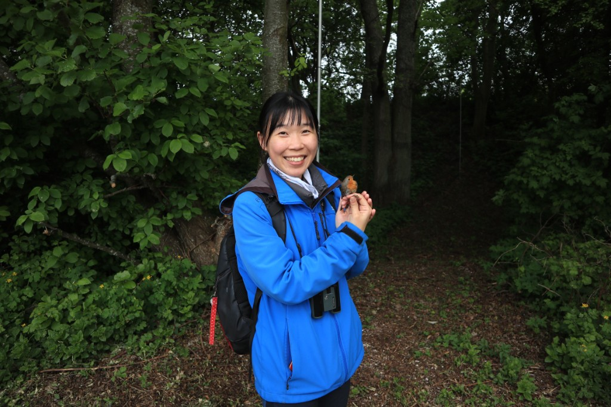
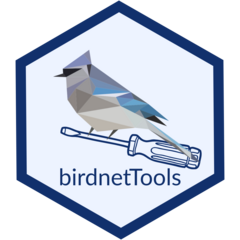
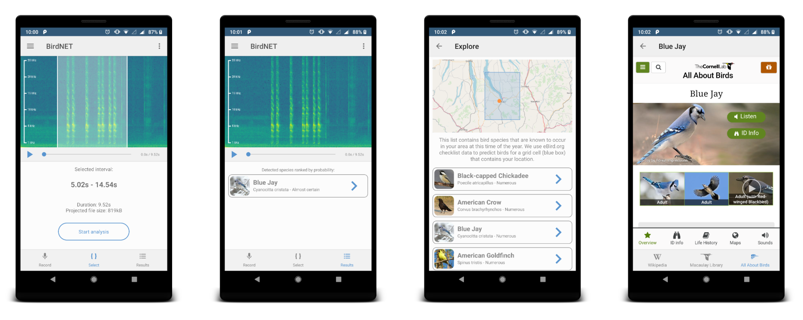
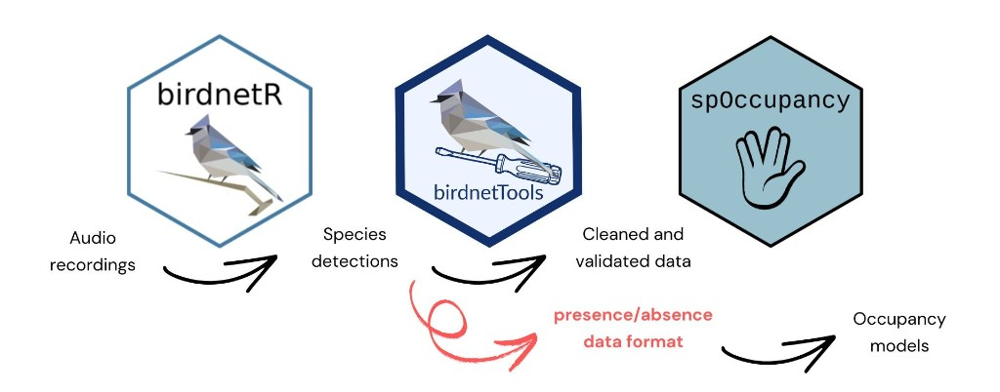

*How an R package is making passive acoustic monitoring more reproducible, transparent, and useful for occupancy modeling*

Passive acoustic monitoring is giving ecologists an unprecedented ability to study birds across large landscapes and long periods of time. Machine-learning systems such as BirdNET can identify thousands of species in audio recordings, but detections alone are not yet ecological conclusions. Researchers still need to clean, validate, and restructure those outputs before they can use them in rigorous statistical models.

Sunny Tseng, PhD, is an independent ecological consultant and R programmer based in Vancouver, Canada. A bioacoustician by training, she has conducted bird research in Taiwan, Canada, Russia, Lithuania, and elsewhere, collecting sounds from more than 300 bird species. She earned her PhD in spring 2026 and now works as a software developer with the BirdNET team at the Cornell Lab of Ornithology while leading international acoustic-monitoring projects and building her independent consulting practice.

{fig-alt="Sunny Tseng during fieldwork, holding a European Robin"}

*Sunny Tseng during fieldwork, holding a European Robin*

Tseng created birdnetTools to help researchers turn BirdNET detections into analysis-ready ecological data. [In the R Consortium's second 2025 grant cycle](https://r-consortium.org/all-projects/2025-group-2.html#birdnettools-20-linking-birdnet-outputs-to-occupancy-modeling-in-r), the Infrastructure Steering Committee awarded the project $7,488 to develop birdnetTools 2.0. The new work connects BirdNET outputs with widely used occupancy-modeling packages including spOccupancy, unmarked, and ubms, while adding standardized workflows, validation, and tutorials.

{width="180px" fig-alt="birdnetTools hex sticker logo"}

**Project website:** [birdnetTools](https://birdnet-team.github.io/birdnetTools/)

**Get started:** [birdnetTools article](https://birdnet-team.github.io/birdnetTools/articles/birdnetTools.html)

The R Consortium spoke with Tseng about the package, the broader BirdNET ecosystem, and the next challenges for acoustic ecology.

*This interview has been edited for clarity and length.*

**1. You work closely with the Cornell Lab of Ornithology, and birdnetTools is now listed as part of the official BirdNET ecosystem. How does birdnetTools fit alongside BirdNET, Merlin, and eBird? Are researchers using these tools together as part of a larger workflow?**

I am an ecologist, and I did my PhD on bird-sound analysis at the University of Northern British Columbia. We used passive acoustic monitoring in the forest, and I was the first person in our lab to propose using AI. I started my PhD in 2021, the year BirdNET was released, and I was drawn to the project because the team promotes open science and shares Python code for collaboration. My first involvement was helping translate the BirdNET interface into Traditional Chinese. Later, the team contacted me about developing an R package. I received Canadian government funding for an international collaboration and spent three months working with the team in Germany; that was the birth of birdnetTools. Their backgrounds are mainly in computer science, while mine is mixed — part computer science and part ecology. I felt my role was to be a bridge: I could explain what ecologists need from using BirdNET, and I could also explain why a requested function might be difficult to build.

{fig-alt="BirdNET app screenshots showing bird sound identification"}

*BirdNET app screenshots. Image: [BirdNET](https://birdnet.cornell.edu/), Cornell Lab of Ornithology.*

BirdNET, Merlin, and eBird are related, but they serve different purposes. BirdNET and Merlin both identify birds from sound. BirdNET is completely open source and oriented more toward scientific users, while Merlin is a user-friendly phone app for birders and the public. eBird is primarily a citizen-science database of observations. These tools can complement one another, but birdnetTools has a specific scientific role. It begins after a researcher has generated BirdNET detections and needs to wrangle, validate, or model those results.

**2. For readers who may not be familiar with passive acoustic monitoring, what problem does birdnetTools solve? How does it simplify the process of going from BirdNET species detections to scientifically rigorous occupancy models?**

The biggest contribution of birdnetTools, especially the occupancy-modeling functions, is data wrangling. Occupancy modeling is frequently used with acoustic detections because the data can be reduced to presence or absence, but the detection history must be assembled carefully. For a given site and time period, the value is not simply one or zero: it can also be NA, which represents no sampling effort. A recorder may be deployed but not functioning. BirdNET will have no detections, but that does not necessarily mean no bird was present.

This is the tricky part. Treating a missing recording as a real zero would be wrong; in statistics this is the problem of zero filling. birdnetTools provides two functions for it: one creates an effort table from a folder of recordings, and the second combines that effort information with BirdNET output to produce a detection history ready for unmarked or spOccupancy. A user who does not account for these false zeroes can still run a model that appears to work. A standardized workflow also makes the code transparent, so a reviewer can understand the process instead of reconstructing custom wrangling.

**3. Version 2.0 adds support for occupancy modeling workflows through packages such as spOccupancy, unmarked, and ubms. Why was this capability so important to add, and what kinds of ecological questions can researchers now answer that were previously difficult or time-consuming?**

In my PhD thesis, I combined BirdNET output with occupancy modeling in spOccupancy. I had not yet developed birdnetTools, so I did all the data wrangling from scratch and know how much attention every detail requires. Occupancy modeling relates presence or absence to ecological variables such as tree density, canopy height, or temperature.

For example, my research on Olive-sided Flycatchers found that canopy density was negatively associated with occupancy. That matches what birders observe: these birds sit on top of bare trees, sing loudly, capture insects in flight, and tend to use forest edges rather than dense forest. birdnetTools makes it faster and safer to move from acoustic detections to those ecological questions.

**4. One of the goals of birdnetTools 2.0 is reproducibility through standardized workflows, tutorials, and data validation. What kinds of users do you expect will benefit most from these improvements - academic researchers, government agencies, conservation organizations, citizen scientists? Have you already seen examples of how people are using the package?**

Academic researchers will probably benefit the most. Government agencies and NGOs will also use it if they are conducting acoustic analyses. Citizen scientists are probably not the main audience, because this package is more closely related to R analysis.

One published paper has already mentioned birdnetTools as an upcoming package useful for sound analysis. We are also submitting birdnetTools to the Journal of Open Source Software, and that paper is currently under review. We have started a methods paper that will walk through the full workflow: process recordings, generate detections with birdnetR, wrangle the data with birdnetTools, run a model with spOccupancy, and interpret ecological results.

**5. How should researchers understand the relationship between BirdNET-Analyzer, birdnetR, and birdnetTools? Where does birdnetTools 2.0 fit in the workflow after BirdNET detections have been generated?**

BirdNET-Analyzer is the core. It is the Python software and the machine-learning heart that processes the recordings. birdnetR is a wrapper around that core, so people can run BirdNET-Analyzer through R.

birdnetTools is separate from those two. It does not generate the detections. It handles post-processing after the BirdNET output already exists. The workflow is sequential: first process the audio and generate detections with BirdNET-Analyzer, either directly or through birdnetR. Then use birdnetTools to clean, organize, validate, and prepare the detection data for further analysis, including occupancy modeling. Because there are two R packages associated with BirdNET, people can understandably be confused, but they perform different steps.

{fig-alt="Workflow diagram showing audio recordings processed by birdnetR into species detections, then cleaned and validated with birdnetTools into presence/absence data for occupancy models in spOccupancy"}

*Workflow from audio recordings through birdnetR detections, birdnetTools post-processing, and occupancy modeling with spOccupancy. Image courtesy of Sunny Tseng.*

**6. Machine learning has dramatically increased the ability to identify birds from audio recordings. What do you think is the next major challenge for acoustic ecology: collecting more data, improving AI models, or making the results easier for ecologists to analyze and interpret?**

The answer is never simply collecting more data. In many cases we already have too much. Teams I know have collected perhaps 10 years of recordings and then ask whether I can help them produce scientific results. The problem is no longer only obtaining recordings; it is determining what those recordings mean. The World Soundscape project led by Kevin Darras and published in 2025 gathered metadata from monitoring projects around the world. I contributed information about 66 recorders used around Prince George, British Columbia, from 2020 to 2025. Too often a student collects one or two years of recordings, the project ends, and the data are never used. The important step now is to synthesize existing datasets and make larger, even global, monitoring inferences.

Data storage remains a challenge, but another major need is statistical methods designed specifically for AI outputs. Occupancy modeling is often used because presence-and-absence data happen to fit acoustic outputs well, but it was originally designed for human field surveys. AI detections have their own characteristics, including uncertainty and signal degradation with distance. Other teams are developing modified occupancy models that account for those properties, and I find that work especially exciting.

**7. Would you recommend other R package developers apply for financial support from the R Consortium's Infrastructure Steering Committee? How did the grant help accelerate birdnetTools 2.0, and what advice would you give to prospective applicants?**

Highly recommended! I learned about the R Consortium opportunity through my involvement with Yanina Bellini Saibene at rOpenSci. *(Editor's note: Yanina is also a member of the R Consortium Infrastructure Steering Committee.)* The community encouraged people who wanted to push their packages forward to apply. I really love the feeling of community in R. People support each other, and it is so open. The R Consortium expects the projects it supports to be open source, and that aligns closely with my own philosophy.

The grant gave us dedicated support to move birdnetTools forward, add the occupancy-modeling workflow, and make the work useful to a wider ecological community. My advice is to have a concrete package need and a clear public benefit, and to show how the proposed work will become reusable open-source infrastructure rather than code for only one research project.

**References**

- [Sunny Tseng's website](https://sunnytseng.ca/)
- [birdnetTools project website](https://birdnet-team.github.io/birdnetTools/)
  - [Get started with birdnetTools](https://birdnet-team.github.io/birdnetTools/articles/birdnetTools.html)
- [BirdNET](https://birdnet.cornell.edu/), AI toolkit for conservation
- [R Consortium: 2025 Group 2 funded projects](https://r-consortium.org/all-projects/2025-group-2.html#birdnettools-20-linking-birdnet-outputs-to-occupancy-modeling-in-r)
