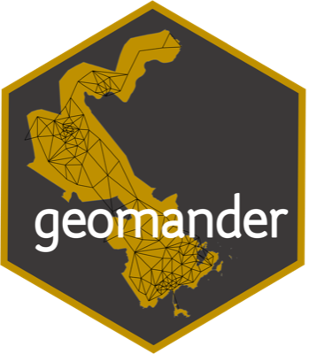
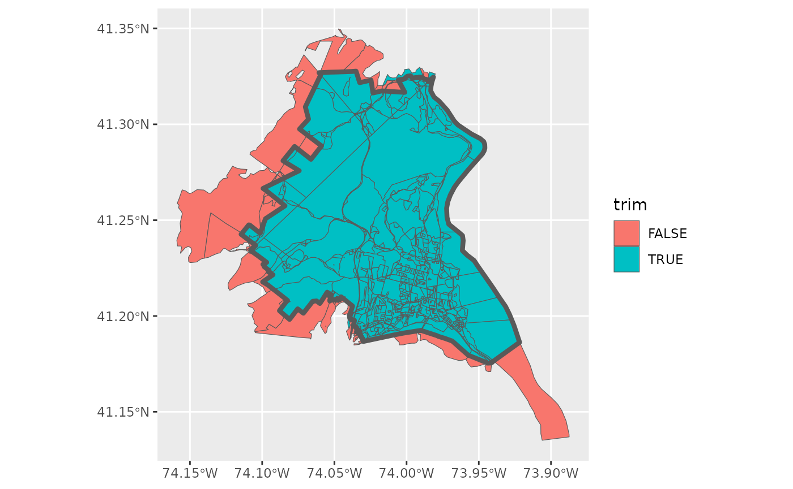
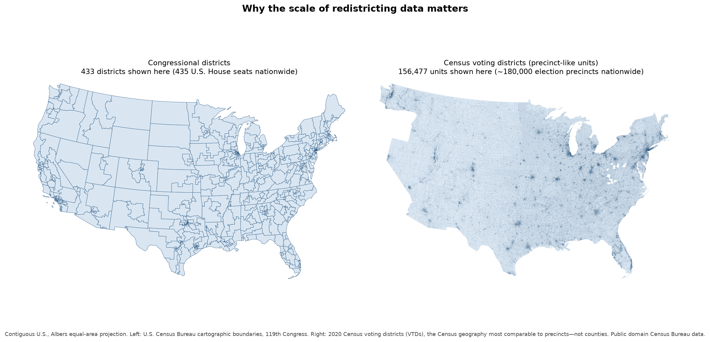

*How an R package makes redistricting data preparation faster, more transparent, and usable across political science, journalism, and voting-rights advocacy*

Redistricting analysis depends on geography that rarely arrives analysis-ready. Census demographics, precinct election returns, school districts, and legislative maps come from different agencies, at different geographic levels, and with boundaries that often fail to line up. Before researchers can simulate alternative maps or evaluate a plan, they have to stitch those sources together, fix gaps and overlaps, and represent legal rules about which areas count as contiguous.

[Christopher T. Kenny, PhD](https://christophertkenny.com/), is a postdoctoral research associate at Princeton Data-Driven Social Science. He received his PhD in Government from Harvard University in 2025, after a B.A. in Mathematics and Government from Cornell University and an M.A. in Government from Harvard. His research focuses on American politics and political methodology, with a specialization in redistricting. He is a founding member and co-PI of the Algorithm-Assisted Redistricting Methodology (ALARM) Project and has been affiliated with Harvard’s Center for American Political Studies, the Institute for Quantitative Social Science, and the Election Law Clinic at Harvard Law School.

{fig-alt="Christopher T. Kenny, developer of the geomander R package"}

*Christopher T. Kenny. Photo courtesy of [christophertkenny.com](https://christophertkenny.com/).*

Kenny developed [geomander](https://christophertkenny.com/geomander/) over the past five years as geographic infrastructure for studying gerrymandering. The package is designed to prepare spatial data for simulation and analysis with [redist](https://alarm-redist.org/redist/), focusing on matching geographies, aggregating and disaggregating counts, and adjusting adjacency so maps reflect legal contiguity rather than messy shapefile artifacts. In 2026, the Society for Political Methodology awarded geomander its Statistical Software Award. Kenny has not received funding from the R Consortium for the package; the interview is part of the Consortium’s broader interest in how R is used across research, public-interest work, and civic analysis.

{width="180px" fig-alt="geomander hex sticker logo"}

**Project website:** [geomander](https://christophertkenny.com/geomander/)

**CRAN:** [geomander](https://cran.r-project.org/package=geomander)

The R Consortium spoke with Kenny about the problems geomander solves, how it fits with redist, and why R has become central to political science and voting-rights work.

*This interview has been edited for clarity and length.*

**1. For readers who are unfamiliar with redistricting analysis, what problem does geomander solve? What kinds of geographic data preparation are difficult or time-consuming without it?**

There are two big things that geomander tries to solve. The first is that data for redistricting come from a lot of different sources. There is no national clearinghouse for this type of data. The Census Bureau provides a lot of the fine-grained demographic data that is used, but every state has its own process, and each county often manages its own election data. When you want to bring these things together, you are working with somewhere between one and about 3,200 independent entities producing data of very different quality.

Amazing tools like sf and geos provide great ways to read the data. geomander says: here are the common problems with that data, and here is how we adjust it in a way that gives you a common output. The second part is in that same vein. It provides tools for stitching the seam between two counties. If, for example, you have Bronx County and Westchester County, two counties that are adjacent in New York but provide the data separately, you know they are adjacent and that their borders should align. Often the data do not. You might have a gap, or a lot of overlap between them, that is not a real geographic gap. geomander helps read in those data sources and then deal with imperfect data—fixing overlaps or gaps—so you can bring things together.

**2. A common challenge is combining information reported at different geographic levels—for example, census blocks, precincts, school districts, and electoral districts. How does geomander help researchers match, aggregate, or disaggregate these data?**

geomander provides a set of very performant ways to match across levels. In the redistricting world we often have a nesting structure: many small units that nest into and cover an entire larger unit. Census blocks—of which there are hundreds of thousands in large states—all nest into congressional districts or state legislative districts.

In the generic spatial-tools world, that creates a giant matrix, say 700,000 rows by 14,000 columns, which is not nice to work with. What we know about the data-generation process is that census blocks will almost never be split. Rather than working with that giant matrix, geomander asks what the best match is for a given block. That immediately reduces the problem and is significantly faster.

For repeated spatial operations like that, geomander uses the geos package, which is a much lower-level approach than the standard sf package a lot of these tools would otherwise use. It tries to use what we know about how districts are drawn to reduce the computational burden. Once you have a crosswalk between the small geographies and the big geographies, there are additional helpers to aggregate those blocks into precincts within a county or across counties, so you can get from those 700,000 rows down to the 2,000 or 3,000 precincts you want to work with most of the time.

One of the things that makes redistricting have this structure is detailed legal rules that constrain how you can draw plans. In the United States, in the 2010 cycle and the 2020 cycle as well, only something like six blocks were split in the entire country, out of millions of blocks. That gives a lot of structure you can use on the R side. These blocks are drawn in concert with the towns and counties they are drawn for. They become a common unit that people actually draw their plans out of, and they have input between each decade on how they think those units should change. The Census Bureau started collecting the shapes for the 2020 Census around 2017 or 2018, making prototypes by 2019, when they were finalized. They repeat this process every decade and the shapes change every decade. It is a multi-year process involving a lot of different players, and that happens to be very useful when you want to break data down or make the matching fast.

{fig-alt="Map of census blocks around North Rockland Central School District in New York. Blocks that remain after geomander’s geo_trim function are shown in teal; blocks that fall outside the district are shown in red."}

*geomander trimming census blocks to a target school district. Teal blocks stay; red blocks are outside the district and would be dropped. Figure from the [Redistricting School Districts](https://christophertkenny.com/geomander/articles/Redistricting_School_Districts.html) vignette on [christophertkenny.com](https://christophertkenny.com/).*

**3. geomander is designed to work alongside redist, while focusing on the geographic preparation required before simulation and analysis. How do the two packages fit together in a typical redistricting research workflow?**

They will almost always be sequential. You start with geomander and then work with redist. geomander provides the geographic tools for blending this data. As we discussed with election data, you will have demographic data, and you might have voter-file data that you need to aggregate. All of these types of data can be brought together on the geomander side.

Then there is a little switch you have to make: the spatial data frame is going to be represented by redist as a graph—in the mathematical sense of vertices and edges—where each unit, say a precinct or a voting district, is connected to the places it is geographically adjacent to. That contiguity defines the edges; the precincts define the vertices. That falls prey to all of the county-level issues we talked about: data that have not actually been matched up, or a hole in the map.

What geomander has, to get you from step one to step two, is a bunch of tools that help you adjust the contiguity of your objects artificially. It is a lot of work to try to change the actual shapes, and editing the shapes is not going to get you any purchase in downstream analysis. Instead you say, artificially, we are going to connect this part of the map. Some states, such as Idaho, have rules that precincts are only contiguous across counties if they are connected by a major highway. There you will see precincts that are geographically contiguous but legally are not. geomander also has tools that say: let’s remove the seam between the two counties; we’ll remove all those edges.

So geomander is the pre-data-wrangling and pre-cleanup step, and it gives you rules to handle that. That’s exactly right. All the different tools are inspired by things like Idaho’s unusual rules, or the fact that San Francisco is not actually connected geographically to parts of the state where it should be treated as connected. You have islands off to the side that are considered contiguous to their nearest point on land in the county. That becomes a single line in geomander because we know those types of rules are out there. Then redist can take in that shape with its somewhat artificially constructed graph—fake in the geographic sense, but made to be truthful to how that geography is legally defined. From there you can generate large sets of alternative redistricting plans, drawn depending on what constraints are allowed by a given state.

**4. Which geomander capabilities do you consider especially important or distinctive? Are there particular functions or workflows that have proven more useful to researchers than you initially expected?**

There is one that stands out: a contiguity checker on your adjacency graphs. Packages like igraph have incredibly fast implementations. This gives a relatively quick line that can apply to large matrices. Sometimes you generate plans that may not be contiguous. When I have gone to work with this, it is one of those tools that lets you check, for very large numbers of plans, whether they are contiguous under different ways of thinking about contiguity. That has become one of the particularly helpful tools.

This matter is not just for the United States. Off of my team, there is a group that works on Japanese redistricting. If you think we have island problems, they have island disasters, because everything is an island, and things like contiguity are defined by area gaps. That becomes a major problem. One of the things that can happen is that you set up these artificial adjacencies incorrectly and create a backdoor loop. You never want to introduce a loop when you are doing this, because you can end up creating non-contiguous plans based on that adjacency. This type of check is very helpful for that back-of-the-envelope question: did we do things wrong? Do we need to adjust things and rerun?

**5. Who is using geomander today? Is its audience primarily academic researchers, or is it also being used by journalists, government agencies, voting-rights organizations, mapmakers, or others working on redistricting?**

Naturally, most of the audience is academic researchers. But I do know the *San Francisco Chronicle* has used it, along with redist, for some research. There are journalists in Florida who have used it. Then the rest of it is mostly voting-rights organizations. There is a lot of litigation that happens following the passage of pretty much any redistricting plan these days. From speaking with people and seeing expert reports and briefs of organizations to courts, it is used heavily there for preparation.

That is because most of the people who are working on voting rights are using R. The preponderance of political science is in R. A lot of the methods that political scientists would use exist in R—the causal inference methods, graphing, of course. Things like the tidyverse are taught in pretty much every political science course now. Some of this is just the weird history of the field. About 25 years ago there were only two political science departments that taught statistics. Both of them started using R, and that has passed through generations of people training the next generation. I actually do not think I could name a single political science department that is not using R as its primary thing. Of course there are some people who use Stata, and a small set of things in Python, but pretty much the whole field uses R.

**6. Geographic boundaries from different data sources often do not line up perfectly, and different matching or estimation methods can produce different results. How should researchers validate these choices and communicate the assumptions or uncertainty involved? How does geomander help make that process more transparent and reproducible?**

To use geomander, you need to write the code, and it is going to give you a report of exactly what you connected and in what order. It will give you exact cases, and even things like the citation you should include when you use certain data sources, to try to give everyone a running record of what has changed.

This has become, when I mention litigation, a very important thing, because that setting is much more adversarial than regular academic research. Using geomander to connect those graphs gives kind of an audit log of exactly what you have done. We also have an interactive tool, redistio, and there is an adjacency editor in there. When you are clicking through the interactive editor, it will print out code that you can copy, and that is exactly geomander code. You can add comments as you go, and it will put it into pipes so you can make a commented, edited block: here we are connecting the roads; here we are disconnecting the counties that are not connected by highways; here are the islands; some cities have roads about rivers, things of that nature.

The whole thing is just to make it very clear exactly what is going on. You can do it by row index, which is not necessarily advised. You can also do it by identifier, so it is very clear what identifiers you are linking.

**7. What’s next for geomander?**

geomander is about five years old now, and the core feature set is fairly fixed. It is a piece in a larger machine, the redistverse—around 15 packages at this point—to cover different parts of the workflow, different types of data, different types of visualization, contracted tools, and so on. The core purpose of geomander is fixed. A lot of what will continue to come out are things like rewriting core functionality in Rcpp or C when we start pushing more data or decide it needs to be faster. Pretty much for the last year there have been almost no new features. Almost every change has been taking an existing tool and putting it in C or C++. That makes it significantly faster without changing the user experience. It is still just the same function.

Of course things will get added over time. There are always new groups that appear that do collections of election data. One of the sets of tools for data ingestion is ways to read a given organization or educational group’s set of names into a common format. One thing that I know will be added very soon, because I need it and I started writing it, is support for a relatively newer group that has been collecting redistricting data over the past few years. Since they are collecting a lot of the new election data, they have their own custom name format, and there will be a function that converts all of their names into the clean, readable names we use in geomander.

We are under different constraints, because many of these groups are picking up shapefiles that limit how many characters you can have in a name, so they have their own specific conventions. The goal of geomander is that you can ingest from any format that sf takes, and then you can push it through GeoJSON or GeoParquet, or whatever type of output makes more sense for you. That allows a lot more flexibility. I am doing all the geomander work, but my colleagues, who also use it heavily, have thoughts. They want standardized names that follow a format such as election type and year, all underscore-delimited, so it is very human readable. I know there is something coming soon that will ingest more of those names.

{fig-alt="Side-by-side maps of the contiguous United States. The left map shows 435 congressional districts as large polygons. The right map shows about 156,000 Census voting districts as a much finer mesh."}

*Same country, very different geographic grain. Left: congressional districts for the 119th Congress (435 U.S. House seats). Right: 2020 Census voting districts, the national Census geography closest to precincts—not counties, of which there are only about 3,100. Kenny’s figure of about 180,000 precincts is the election geography researchers actually want to work with. Maps: U.S. Census Bureau cartographic boundary files (public domain).*

There is a feature of this field that only since about 2008 do we have very good precinct-level data. For years before that, most of what is available historically has exceptions—Wisconsin has a great data office that goes back to the 1980s—but in most places you are looking at a snapshot from 2008, and only now, for 2024, 16 years later. For this type of fine-grained data that I often use, it is a very limited window. geomander can take all those different sources and pull them together. We are coming up on a new election, and we will have new data, we can do new things, we can understand more, because that fine-grained data gets us a lot more insight than district-level data. There are only 435 districts at the congressional level. There are about 180,000 precincts. You can do a lot more with 180,000 precincts across the United States than you can with 435 districts. Every election has a chance to get new data.

Before 2008 it was not cataloged in the same way. To use precinct data, you need both the shapefiles and the tabular data—votes for Harris, votes for Trump, and so on. In places, people were not putting out shapefiles for their data. We can get CSVs for 1995, but then you are looking at a CSV that has some identifiers and no way to figure out what those identifiers mean. There is no way to actually use that in research. Even though it exists in a way, the shapes do not. Shapefiles are only an invention of, I want to say, about 1990. There is a lag before counting offices across the United States adopted those types of tools.

The only random tidbit to add is that this package actually started because I needed these tools for classwork during grad school. Most of the core functionality comes out of random analysis scripts from doing problem sets during class. Then the summer after, I sat down to make this useful. That is kind of a fun tidbit of why it even exists.

**References**

- [Christopher T. Kenny’s website](https://christophertkenny.com/)
- [geomander project website](https://christophertkenny.com/geomander/)
- [geomander on CRAN](https://cran.r-project.org/package=geomander)
- [geomander on GitHub](https://github.com/christopherkenny/geomander)
- [ALARM Project](https://alarm-redist.org/)
- [redist](https://alarm-redist.org/redist/)
