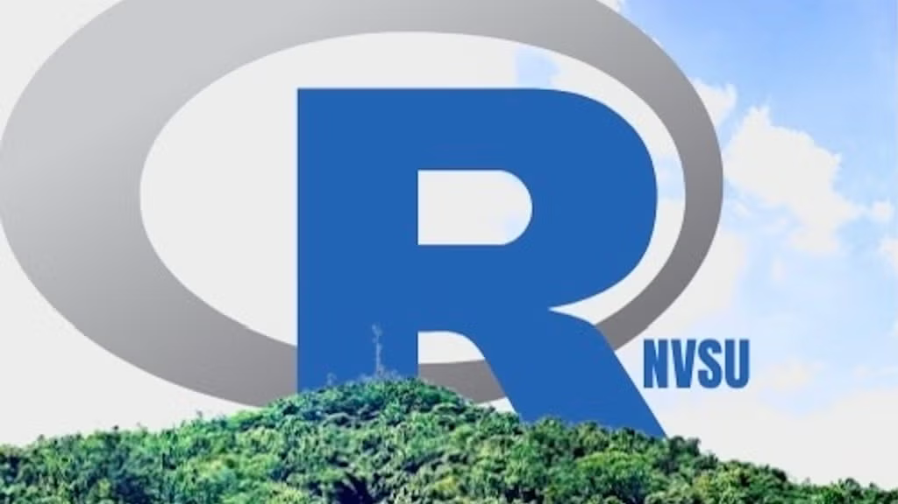
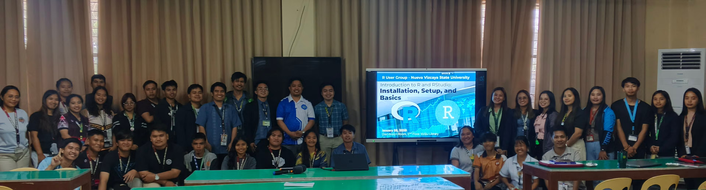

[Dr. Orville D. Hombrebueno](https://www.linkedin.com/in/orville-hombrebueno-1725a8276/), [Romnick Pascua](https://www.linkedin.com/in/romnick-pascua-00424536/), [Mer Joseph Q. Carranza](https://www.linkedin.com/in/mer-joseph-caranza-19182b24a/), [Richard J. Taclay](https://scholar.google.com/citations?user=D2as-VkAAAAJ&hl=en), and Mart Jasper G. Antonio, organizers of the [R User Group of Nueva Vizcaya State University](https://www.meetup.com/r-nvsu/) (RNVSU) recently spoke with the R Consortium about building a provincial, university-based R community in the Philippines. They shared how the group evolved from a handful of faculty members independently using R for theses, mathematical modeling, biodiversity research, and land-use analysis into a funded initiative promoting reproducible research and open science. The team discussed launching foundational workshops, introducing GitHub and Quarto workflows, organizing hybrid events for their university’s charter anniversary, and envisioning dashboards and data-driven tools to support local education, agriculture, and research.

{width="50%"}

**Please share about your background and involvement with the RUGS group.**

**Orville**: I’m Orville D. Hombrebueno. I was introduced to the R programming language back in 2017 while finishing my master's thesis. I was working on time-series analysis and sought advice from [Professor Erniel Bayhon Barrios](https://research.monash.edu/en/persons/erniel-bayhon-barrios/) at the University of the Philippines. At the time, I was using a cracked version of Mathematica, but the professor suggested that I try R, highlighting its open-source nature and effectiveness as a tool.

I completed my thesis using R, and after a few months, I became curious about RStudio. I taught myself coding in R by exploring free online books and blog posts. The resources Professor Barrios shared also contributed a lot, particularly the [ISLR](https://www.statlearning.com). Eventually, I discovered the R community, which significantly engaged me with the language.

I first joined the [RUGPh](https://www.meetup.com/r-user-group-philippines/), an R user group based in Manila, Philippines. However, I am mostly interested in attending R communities and user groups abroad, particularly the R Ladies community. They are very active, and many members are from academia, which allows me to relate to the topics they discuss and the talks they host.

**Romnick Pascua:** I don’t know if it’s just a coincidence, but during the year when Sir Orville was being introduced to R, I found a webpage that was incredibly helpful while I was searching for resources to finish my thesis. I discovered that, in addition to using data, R would be a powerful tool for conducting my experimental research on cloning plants through cuttings in vegetative propagation.

My involvement in the R community is particularly focused on plant cloning and vegetative propagation studies. I use R to organize, clean, and analyze my data from various cloning trials, including survival rates, rooting percentages, the number of roots, and any other parameters relevant to my thesis. I have found R to be very versatile, even if it may not be as advanced as Stata or SAS.

Using R, I completed my research journal on species in the Myrtaceae family in Bago-Adlao, which was published in a well-known Malaysian journal. I also completed my thesis from a biodiversity perspective, focusing on plant biodiversity.

When I met Sir Orville, we discussed forming a group. Until then, I was not very aware of the R user community, but Sir Orville helped me connect with it. I believe that participating in our community will provide me with valuable opportunities to explore the features available.

I have already begun using packages such as [Tidyverse](https://tidyverse.org/), [ggplot](https://ggplot2.tidyverse.org/), and [Agricolae](https://cran.r-project.org/web/packages/agricolae/index.html), but I feel this journey is closely tied to our collective capabilities. Through these valuable interactions and interviews, I hope to access tutorials and resources, as this is my first experience with such an organization. I have high expectations for future forums and hope we can contribute to the documentation in our fields of specialization.

We also aspire to develop scripts that could benefit the R community, especially for experimental research in plant cloning. I believe that this interaction will enhance the experiences of everyone involved in our community.

**Mer Joseph:** My name is Mer Joseph Q. Carranza, and I am a colleague of Sir Romnic and Sir Orville at our university. I would like to express my gratitude to Sir Orville for inviting me to join our newly formed R user group recognizing my potential in using R.

For my master's thesis, I am focusing on the fragmentation of land use cover and land classes within a protected area. One of the key analyses involves classifying land use and land classes. My primary engagement with programming has been with Python, specifically for classifying these land uses.

Sir Orville has introduced me to many new concepts related to R, particularly how to integrate it into geographical analyses. I see great potential in using R to duplicate and share templates and code, and I find significant value in this tool. As a beginner, I am eager to learn more.

Once again, I want to thank Sir Orville and our other colleagues for sharing their knowledge and fostering a collaborative environment in which we can grow together.

**Richard Taclay:** Hello, I am Richard J. Taclay, and I am pleased to be part of the R Users Group (RUGS) organized within our University. As a faculty member and researcher with a strong inclination toward mathematical modeling and pure mathematics, I view RUGS as an important platform for scholarly collaboration and continuous professional growth.

My research work frequently interconnects with statistical computing, particularly in the development and analysis of mathematical models. In this regard, R has become an essential tool in my workflow, supporting data cleaning, visualization, and time-series analysis, and facilitating reproducible and transparent research practices.

The RUGS community provides a meaningful space for exchanging ideas, exploring advanced analytical techniques, and examining how computational tools can further enrich mathematical inquiry. Through my involvement in RUGS, I hope to deepen my technical expertise while contributing to a culture of shared learning. I am especially interested in strengthening research capacity and promoting data literacy within our academic community, leveraging R as a powerful instrument for both instruction and research advancement.

**Mart Jasper G. Antonio**: Hello, I am Mart Jasper G. Antonio, a faculty member of Nueva Vizcaya State University under the Department of Mathematics and Statistics in the College of Arts and Sciences. Honestly, R was introduced to me by Dr. Orville Hombrebueno way back in 2024. I find R useful because it focuses on data analysis and mathematical computation, both of which interest me. When I was accepted into NVSU, I started exploring R, particularly for statistical analyses. Then, one time, Dr. Orville approached my other colleagues and me to start a group called RUGNVSU.

I believe this group will broaden my knowledge and hone my skills in data analysis and mathematical computations. Now, I am exploring model development and geographic visualizations in R, which are among R's strengths compared to other computational software. Moreover, it is an honor to be one of the founders of this group, as it serves as a platform to support and help students, academicians, scholars, teachers, and researchers in their academic and professional endeavors.

**Can you share what the R community is like in the Philippines?**

**Orville**: The R User Group of Nueva Vizcaya State University (RNVSU) is located at the university in Bayombong, Nueva Vizcaya.

When discussing the R community in the Philippines, particularly the RUG-Ph, most members come from the industry. Many are very knowledgeable about R, but they often don't use GitHub in their meetups. This creates a different situation from that in communities abroad, where GitHub is actively promoted. There, members share repositories of talks and live-coding scripts. In contrast, our community tends to focus more on industry applications, which often feel less open.

In our province, we are just starting to build our local R community. I've been using R for about eight years; recently, I wrote my dissertation using R and Quarto. I am proud to have used R for both the analysis and documentation. I work as a math teacher in the College of Teacher Education at the university, and most of the time I use R and RStudio in my instruction, research, and extension work. At the university, I met Mr. Pascua, who also uses R. However, we often feel isolated in our use of R, relying on it for personal projects, statistics in student research, my research analyses, and report creation. Some students and faculty members have had opportunities to attend training sessions offered by various universities or organizations, but many of these events are paid, and again, the use of GitHub is not promoted. Together with these faculty members and students, we organized RNVSU.

Our R user group is among the few in the country to have received a grant from the R Consortium. We are very thankful that the R consortium is funding our events. Last time I looked, we have 220 members from our university, the province, the country, and abroad. RNVSU provides a great opportunity for R users to organize and work together to promote the use of R within our university and province. We are looking forward to promoting reproducible research and open science, making NVSU a hub for open science in the country. Also, we envision being involved in the community, solving wicked problems using R. It will be a platform for learning, collaborating, and showcasing R stuff.

Our first in-person meetup, Introduction to R and RStudio: Installation, Setup, and Basics, was heldon January 28, 2026, and attended by 34 faculty members and students from NVSU and Nueva Vizcaya General Comprehensive High School. Most of the participants are beginners.

**Mart Jasper:** Prior to the development of the RNVSU, during a meeting with Sir Orville, he showed us that there was only one existing r user group in Meetup here in the Philippines. Realizing this, we are challenged and inspired to be among the first groups established in the country. We are happy and proud to contribute to the growing data science and statistical computing community in the Philippines through R.

**Mer Joseph:** From my very new perspective, the R community in the Philippines, especially through the lens of our new group, feels like it's on the cusp of something exciting. Before Sir Orville and the others organized us, my view of the community was very distant. I knew it existed, but it felt like something for experts in Manila or in industry, which Sir Orville confirmed when he described the RUG-Ph as being more industry-focused.

What's different and so valuable about our group, RNVSU, is that it's bringing that community feeling right here to our province. It's making it local, academic, and beginner-friendly. Hearing that we're one of the few groups in the country to get an R Consortium grant is amazing-It makes me feel like I'm part of something significant right from the start. It's not just a faraway community of experts; it's becoming a community of learners and teachers right here on our campus, focused on collaboration and open science. It’s a much more welcoming entry point for someone like me.

**Richard Taclay**: The R community in the Philippines is a growing, collaborative network of statisticians, data scientists, educators, and students who use R for data analysis, research, and policy work. The RNVSU group brings forth a new avenue to further expand the reach of R users in the country. R becomes readily available, accessible, and user-friendly to locals. Not only do mathematical researchers learn more about R, especially its statistical prowess in data visualization, but also, collaborative work is created and strengthened.

**Do you have a roadmap for the upcoming year? How do you plan to host events—will they be in person, online, or hybrid? Additionally, do you have a list of topics you hope to cover this year?**

**Orville**: After covering installation basics and some essential functions, we plan to focus on GitHub, specifically how to use GitHub in RStudio. Following that, in March, we will be celebrating our university's charter anniversary. We anticipate hosting three talks at this event and will try to invite speakers from various user groups worldwide, including some from R Ladies and Posit. We are considering organizing the first talk on data wrangling, the second on data visualization, and the final one on modeling. This event will be online or hybrid, and we are currently figuring out the logistics. After this, we plan to introduce Quarto.

Beyond this event, we discussed exploring the areas of specialization of those who are supporting and attending our meetups, particularly the most trending and recent applications of R in their fields. We believe these discussions are valuable in planning our future meetups, especially for faculty members and students from our university.

We are very interested in creating shiny dashboards because we believe it’s a great tool to use to provide valuable insights to various stakeholders. Our events will hopefully lead to this outcome. For instance, we need dashboards for our office heads – including our president – to monitor key indicators crucial to advancing our university’s vision.

Currently, we also have a proposal for a project focused on forecasting weather and vegetable prices. We aim to create a dashboard for farmers to access this information. This is one reason why we plan to learn and become proficient as a group in developing dashboards, shiny apps, and websites using Quarto.

Moreover, in mathematics education, I find using Quarto incredibly beneficial. It allows us to create our own presentations, handouts, and websites. We can even publish books and generate dynamic documents, all of which are valuable tools in creating instructional materials. This can be another direction for RNVSU. We can explore options such as Quarto Live to create these instructional resources effectively.

There is much to look forward to. We are planning to hold collaborative sessions to work on projects that solve wicked problems in our local community. Furthermore, we are planning networking sessions to collaborate with our members from around the world. I am excited about the contributions from my fellow members as we embark on this journey together.

**Pascua:** We plan to expand the dashboards by integrating maps and specialized visualizations. With the help of our two young colleagues, Sir Mer and Sir Jasper, I believe we can develop something that will further Sir Orville's vision for our university dashboards.

Additionally, there are many agricultural commodities we could leverage R and its integrations. These ideas represent our future; I'm not sure if it’s a formal plan or just a dream, but I truly believe we can achieve it.

We are quite ambitious. As a member of the College of Teacher Education, I am also thinking about promoting R to high school students. This way, when they enter college, they will already have some familiarity with the subject, so we won’t need to spend time orienting them on the basics. We really want to highlight our programs in the province and encourage everyone to use R.

**Mart Jasper:** With the funds provided, we are planning to maximize the funds by conducting multiple workshops and seminars, not just to NVSU community but to those out there willing to learn R. We have contemplated a lot of topics for the upcoming meetings but for the first several seminars, we plan to conduct fundamental and foundational topics in R - from installation, Git and Git Hub, data wrangling, etc. - before tackling advanced and practical computations/analyses. The advanced topics in R include: visualization, statistical analyses, and mathematical modelling.

**Mer Joseph:** As a beginner, the roadmap Sir Orville and the team have laid out is exactly what I need. Starting with the installation basics at our first meetup was so helpful. Now, knowing we're going to tackle GitHub next is both scary and exciting-I've heard it's a key part of making work open and reproducible, which is a big goal for our group.

I'm really looking forward to the March event for our university's charter anniversary. Having it online or hybrid is great because it might feel less pressure, and we can learn from speakers from groups like R Ladies. The planned topics are a perfect learning path for me: first, learning how to clean and organize data (data wrangling), then how to show it (visualization), and finally, how to build models with it. It builds step-by-step.

Beyond that, I'm also very interested in the long-term goals. Sir Pascua's dream of creating dashboards for farmers and Mart Jasper's interest in advanced topics show me where this journey can lead. For now, I'm focused on foundational topics, from installation to wrangling, so that someday I can contribute to larger projects, such as creating a Shiny dashboard or using Quarto, as Sir Orville discussed. It feels like we have a clear path from being a complete novice to building something useful for our university and community.

**Richard Taclay:** I support the roadmap presented by Sir Orville and the group. I look forward to a growing number of R users in the locality as a result of the dashboard's creation. As one inclined toward research in mathematical modeling, mathematics education, and pure mathematics, I believe that data visualization in R is a powerful tool for supporting mathematical research. The first step in the road map is to introduce R to the community (the university) and expand. Then, conduct seminar-training workshops using R, leading to mathematical research towards journal publication or to better our own R publication of mathematical research.

**You hosted a Meetup titled “[Using Git and GitHub in RStudio](https://www.meetup.com/r-nvsu/events/313201432/?eventOrigin=group_events_list).” Can you share more on the topic covered? Why this topic?**

**Orville:** Last month, we hosted a session with Federica Gazzelloni of R-Ladies Rome on the basics of using Git and GitHub in RStudio. We chose this topic for our second meetup because we want our members—especially faculty and students from our university—to develop good coding and version control practices early in their data science journey.

This March, in celebration of our university’s 22nd Charter Anniversary, we are organizing a three-part meetup series designed to build foundational data science skills step by step. The sessions include: [Introduction to tidyverse,](https://www.meetup.com/r-nvsu/events/313596811/?eventOrigin=group_events_list&utm_medium=referral&utm_campaign=event_card_savedevents_share_modal&utm_source=link&utm_version=v2&member_id=255087002) [Tidyplots for Easy Visualization](https://www.meetup.com/r-nvsu/events/313337627/?eventOrigin=group_events_list&utm_medium=referral&utm_campaign=event_card_savedevents_share_modal&utm_source=link&utm_version=v2&member_id=255087002), and [Introduction to tidymodels](https://www.meetup.com/r-nvsu/events/313596851/?eventOrigin=group_events_list&utm_medium=referral&utm_campaign=event_card_savedevents_share_modal&utm_source=link&utm_version=v2&member_id=255087002). Together, these talks guide participants from data wrangling to visualization to modeling—helping them gain confidence in practical, structured data analysis using R.

In April, we will host an [Introduction to Quarto](https://www.meetup.com/r-nvsu/events/313601010/?eventOrigin=group_events_list) session. Quarto enables users to integrate code, analysis, and narrative into a single reproducible document for reports, presentations, and research outputs. This completes the workflow—from data analysis to transparent and professional reporting—while promoting reproducible research and open science.
