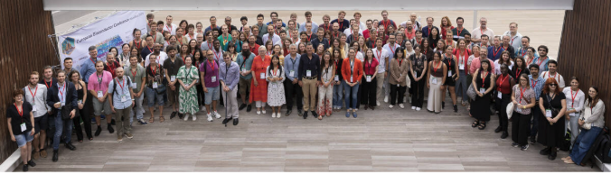
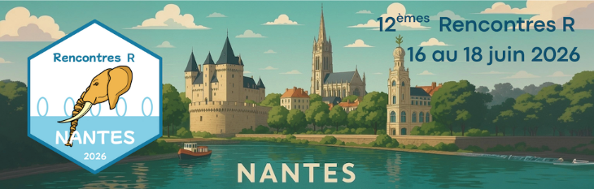
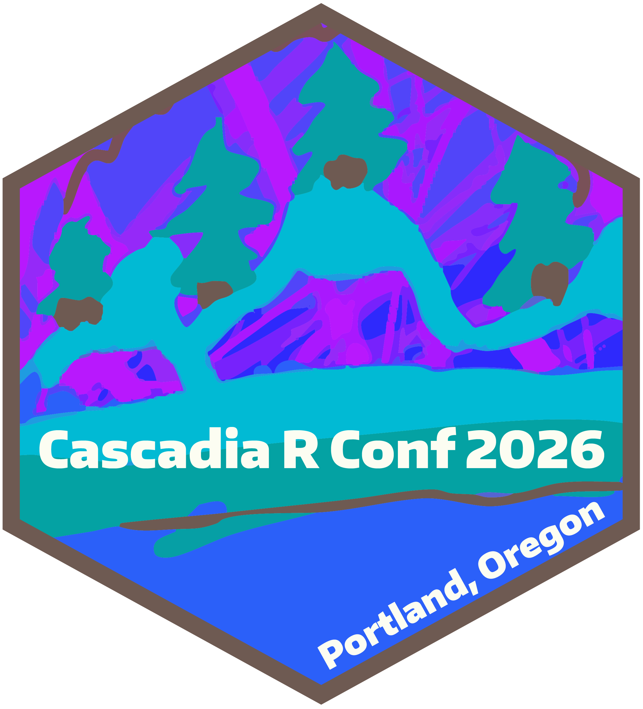
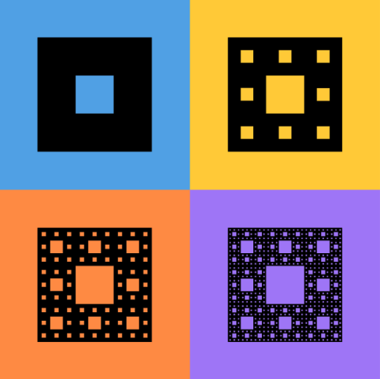
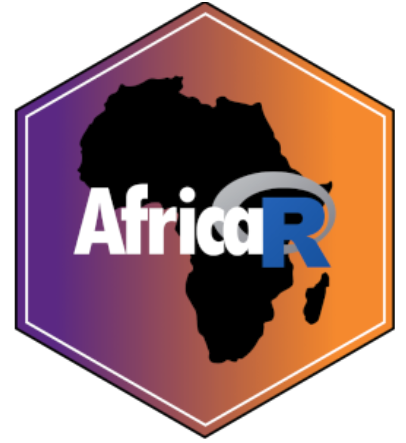
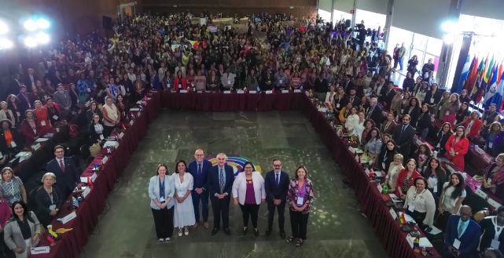

The R ecosystem continues to grow because of its community - organizers, educators, and practitioners who create spaces for collaboration and learning. These efforts often happen independently, across regions and domains, yet collectively they shape the future of R.

At the R Consortium, we actively invest in that layer of the ecosystem. In 2026, we are committed to support R-related events and community initiatives worldwide, with a particular focus on strengthening independent, community-led conferences and user groups.

Please note that R Dev Days are connected with three of the events listed below. These are open, collaborative events that help participants contribute base R. Both new and experienced contributors are welcome.

You can explore the full list of supported events here:  
👉 [R Consortium Events Page](https://r-consortium.org/news/events.html?utm_source=chatgpt.com)

## Supporting Key Global Events

As part of this annual initiative, we support important R-related events listed under our Upcoming Events. The events reflect different regions, audiences, and applications of R, demonstrating the breadth of the R ecosystem.

## [EuroBioC 2026](https://eurobioc2026.bioconductor.org/)

EuroBioC focuses on the Bioconductor ecosystem and the use of R in bioinformatics and computational biology. It is being held in Turku, Finland, during the first week of June. It connects scientists working on genomics, proteomics, and related fields, highlighting how R supports cutting-edge research in the life sciences.

## [Rencontres R 2026](https://astamm.github.io/en/rr2026.html)

Rencontres is a long-running conference rooted in the French-speaking R community. It is organized by the French Statistical Society (SFdS) and brings together researchers, public sector professionals, and industry practitioners to share applied work and foster collaboration. Its regional focus helps strengthen R adoption across Europe while maintaining strong technical depth. Rencontres is open to beginners as well as experienced users from all sectors and is being held June 16-18 in Nantes, France.

This year’s Rencontres will also host an R Dev Day, supported in part by recent funding from the Research Software Maintenance Fund. Join this open, collaborative event to contribute to the code and documentation of base R, or to the infrastructure that supports those contributions. Both new and experienced contributors are welcome.

R Dev Day @ RencontresR 2026  
Fri, June 19, 9am - 5pm UTC+2  
Location: On-site at Nantes University or virtual  
Working languages: French and English

Registration deadline: Friday, May 29, 2026  
[https://pretix.eu/r-contributors/r-dev-day-rr2026/](https://pretix.eu/r-contributors/r-dev-day-rr2026/)

## [Cascadia R Conference](https://cascadiarconf.com/)

{width=50%}

The Cascadia R Conference serves the Pacific Northwest in the US, with a strong emphasis on practical data science and community engagement. It is held in Portland, OR, running over two days on June 26-27. Cascadia R is known for being accessible, welcoming, and highly relevant to both new and experienced R users working in industry and academia.

There will be a satellite R Dev Day event at CascadiaR. Join this open, collaborative event to contribute to the code and documentation of base R, or to the infrastructure that supports those contributions. Both new and experienced contributors are welcome. Please note: This is a satellite event to Cascadia R Conf 2026, which takes place on Sat, June 27 in Portland, OR, USA. It is not necessary to register for the main conference in order to attend the R Dev Day.

R Dev Day @ Cascadia R 2026, Portland  
Fri, June 26, 2026  
Location: On-site or virtual  
Working languages: English

Registration deadline: Fri, June 12, 2026  
[https://pretix.eu/r-contributors/r-dev-day-cascadiar-2026/](https://pretix.eu/r-contributors/r-dev-day-cascadiar-2026/)

## [useR! 2026](https://user2026.r-project.org/)

The useR! 2026 conference is the flagship global gathering of the R community, taking place this year July 6 - 9, 2026 in Warsaw, Poland. It brings together data scientists, statisticians, developers, and researchers from around the world for keynote talks, hands-on workshops, and community-driven sessions that showcase cutting-edge applications and developments in the R ecosystem.

There will be a satellite R Dev Day event at useR! 2026. Join this open, collaborative event to contribute to the code and documentation of base R, or to the infrastructure that supports those contributions. Both new and experienced contributors are welcome.

Please note: R Dev Day @ useR! 2026 is a free, hybrid event that will take place on July 10, the day after the conference concludes. You will need to fill out a self-nomination form, this is different from registering. Participants will be selected from the nominations received to fill the available places, balancing experience levels and giving opportunity to members of historically underrepresented groups. R Dev Day is free of charge. No support is available for travel or accommodations. Registration at useR! 2026 is not required to participate in R Dev Day.

R Dev Day @ useR! 2026  
Fri, July 10, 2026  
Location: On-site at Warsaw University of Technology or virtual

Nomination deadline: Fri, April 24, 2026  
[https://user2026.r-project.org/additional/r-dev-day.html](https://user2026.r-project.org/additional/r-dev-day.html)

## [Ghana R Conference](https://ghana-rusers.org/ghana-r-conference-2026/)

The Ghana R Conference 2026, organized by the Ghana R Users Community, will take place July 9 - 10, 2026, at Accra Technical University in Accra, bringing together data scientists, researchers, and practitioners to explore the role of R in advancing Ghana’s digital transformation. Centered on the theme of using R to support AI and data-driven development, the event features talks, workshops, and community engagement aimed at building local expertise and strengthening the data science ecosystem across Ghana and the broader African region.

## LatinR

LatinR is one of the most important R conferences in Latin America. It provides a platform for Spanish- and Portuguese-speaking communities to share knowledge, present research, and build connections across countries. It is being held in early November 2026. Its regional focus helps drive adoption and innovation in fast-growing data science markets.

## Why This Investment Matters

These events differ in geography and specialization, but they serve a shared purpose: enabling people to learn, collaborate, and contribute to the R ecosystem.

Our role is to support and complement these efforts.

Funding from the R Consortium helps organizers:

* Keep events accessible and affordable  
* Expand speaker participation and diversity  
* Improve technical programming and workshops  
* Reach new audiences in emerging regions

In practical terms, this support increases participation and strengthens the quality of engagement across the ecosystem.

## Supporting Grassroots Growth: R-Ladies+

Beyond conferences, we also continue to support R-Ladies+, a global initiative focused on promoting gender diversity in the R community.

R-Ladies+ operates hundreds of local chapters worldwide, offering workshops, mentorship, and community events that lower barriers to entry. Many R users have their first meaningful experience with the language through these groups.

Supporting R-Ladies+ is a direct investment in expanding who participates in R and that has long-term implications for the health of the ecosystem.

## Complementing Our Own Events

In addition to supporting independent events, the R Consortium organizes three annual conferences:

* [R/Medicine](https://rconsortium.github.io/RMedicine_website/)  
* [R+AI](https://rconsortium.github.io/RplusAI_website/)  
* [R!sk](https://rconsortium.github.io/Risk_website/)

These events focus on specific domains where R is widely used. However, our broader strategy is to support a distributed ecosystem rather than centralize activity around a single set of conferences.

## Get Involved - Participants and Sponsors

These events are where applied R work is presented, evaluated, and adopted.

For participants, they offer direct access to:

* Practical implementations from peers working in production environments  
* Opportunities to present and validate your own work  
* Entry points into meaningful open source contribution  
* Professional relationships with practitioners across industries

For sponsors, these events provide a targeted channel into the R ecosystem. Direct engagement with the people actively shaping tools, workflows, and standards.

By sponsoring, your organization can:

* Position itself alongside credible, practitioner-led work  
* Reach highly technical audiences using R in finance, healthcare, AI, and research  
* Engage early with emerging approaches and infrastructure decisions  
* Build relationships with contributors, maintainers, and advanced users

This is not passive brand exposure. It is proximity to the conversations and decisions that influence how R is used in real-world environments.

Explore upcoming events and identify where your organization can participate:

👉 [View Upcoming R Events](https://r-consortium.org/news/events.html?utm_source=chatgpt.com)
