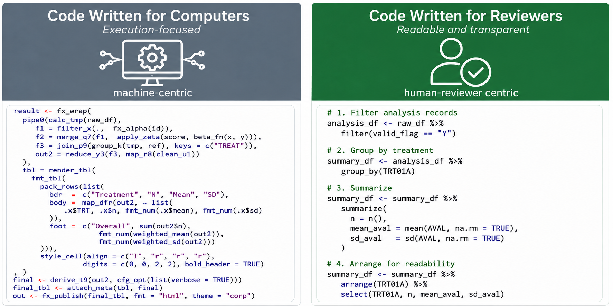

Recently, some sponsors have received FDA feedback asking for SAS-equivalent code for analyses originally submitted in R. For teams investing in open-source tools, that feedback can feel discouraging. But the key message from recent discussion in the R Consortium Submissions Working Group is not that R submissions are infeasible. It is that R submissions need to be easy to reproduce, inspect, and trust.

In an open dialogue with FDA members participating in the working group, reviewers shared that requests for SAS-equivalent code sometimes arise for the following reasons:

- Technical difficulties running the submitted R code
- Differences in statistical methodology between SAS and R
- Greater reviewer familiarity with SAS

While FDA does not endorse any specific statistical software, SAS has historically been the dominant statistical software for regulatory review, and that context shapes the practical challenges reviewers face. In short, reviewers have sometimes struggled to reliably recreate a sponsor's environment, install required packages, run scripts without sponsor-specific assumptions, or validate R results.

This post reflects discussion in the [R Consortium Submissions Working Group meeting on June 5, 2026](https://pr-181--submissions-wg-preview.netlify.app/minutes/2026-06-05/) and should not be read as official FDA guidance.

## R Is Feasible, But Reproducibility Comes First

R offers transparency, a rich package ecosystem, and the benefits of an open-source language where code, methods, and errors can be inspected directly. As FDA's [Statistical Software Clarifying Statement](https://www.fda.gov/media/161196/download) notes, sponsors should consult with FDA review teams early, ensure that software used for data management and statistical analysis is reliable, and have documentation of appropriate software testing procedures available.

Those benefits only translate into a successful submission when the package can actually be run in the review environment. Good practice for R submissions is therefore not simply "use R." It is "submit R in a way that supports efficient independent review."

## Issues That Can Make R Submissions Hard to Review

The working group discussed several recurring issues that can create difficulty for reviewers.

| Issue | Why it causes trouble for reviewers |
| --- | --- |
| No early communication with the review team | Reviewers may not know what to expect, what software stack will be used, or whether there are program-specific concerns to resolve before submission. |
| R environment cannot be reproduced | Reviewers may be unable to install the same package versions, recreate the same system configuration, or successfully run the submitted scripts. |
| Proprietary packages are referenced but not submitted | If an internal package is required but not included, documented, and installable, the submitted code cannot run independently. Proprietary packages should warrant the same level of rigorous verification and documentation expected of packages available on CRAN. |
| Hidden setup assumptions | Scripts may rely on environment variables, startup files, preloaded objects, mounted drives, or manual steps that are not visible in the submission package. |
| Operating-system-specific paths | Hard-coded paths such as Linux directories or sponsor network paths may not work on a reviewer laptop or workstation, especially in a standard Windows environment. |
| Complex nested scripts and functions | Deeply nested functions, functions inside functions, or scripts that call other scripts without a clear entry point make it difficult to understand what is being run and where results are produced. Unnecessary code also adds review burden, such as code used only for cosmetic table or figure formatting. |

## Good Practices for Sponsors

Sponsors can reduce the likelihood of requests for SAS-equivalent code by designing the R submission package around the reviewer's experience.

Discuss R use early with FDA review teams and FDA statisticians. Build a minimal, reviewable analysis package with a clear entry point, clear run order, documented package versions, and no dependency on sponsor systems. Include proprietary packages when they are unavoidable and address that risk before submission. Test the code in a clean environment that resembles the review setting, ideally including a standard Windows environment. Keep scripts human-readable, with clear inputs and outputs and limited hidden state or unnecessary complexity.

## Sponsor Checklist

- [ ] Discuss the planned use of R with FDA early.
- [ ] Document the R version, package versions, operating system assumptions, and system requirements.
- [ ] Include a clear ADRG with required inputs, run order, and expected outputs.
- [ ] Provide a single, obvious entry point for reproducing key analyses.
- [ ] Use relative paths; avoid sponsor-specific, user-specific, or Linux-specific paths.
- [ ] Avoid hidden dependencies on startup files, environment variables, credentials, preloaded objects, or manual setup steps.
- [ ] Include all required proprietary packages and installation instructions, or avoid proprietary packages that cannot be provided for review.
- [ ] Test the submitted code in a clean Windows environment that approximates the reviewer's setting.
- [ ] Keep scripts understandable, with clear run order and limited nesting.
- [ ] Confirm that outputs generated by the submitted code match the submitted results.
- [ ] Include documentation showing that R results are reliable and validated, such as cross-validation of SAS and R results, or transparent and rigorous verification and documentation of R packages used to ensure they produce results as expected.
- [ ] During submission review or when questions are received, offer technical walkthroughs to help reviewers understand the R environment, run order, and key analysis scripts.

## Closing

Open-source languages may feel different from traditional statistical software in regulatory submissions, but many of these good practices are not language-specific. They are reproducibility practices, communication practices, and reviewer-experience practices.

With increasing adoption of LLM-assisted programming, it is even easier to produce code that is overcomplicated, deeply nested, or dependent on hidden setup choices. That makes it even more important to keep the reviewer's experience in mind from the beginning.
