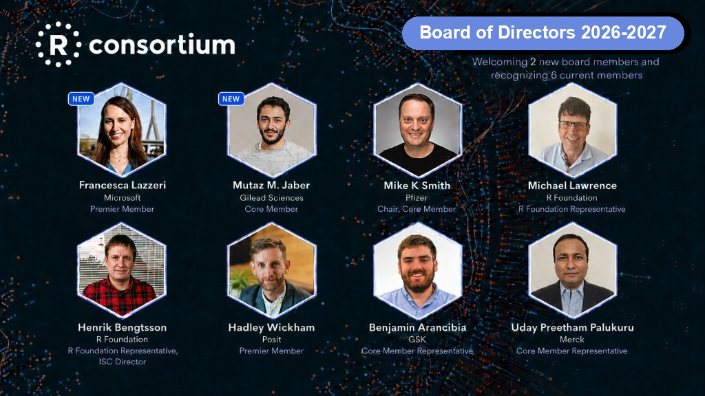

{fig-alt="R Consortium Board of Directors 2026, welcoming two new board members and recognizing six current members"}

We're delighted to welcome two new members to the R Consortium Board of Directors: Francesca Lazzeri of Microsoft and Mutaz Jaber of Gilead Sciences. Together with six returning directors, they will help steer the Consortium's work to grow R infrastructure, support the R community, and keep R thriving as a leading platform for statistical computing and data science.

The R Consortium exists so organizations that depend on R can invest in the R Project directly, collaborate on projects of mutual interest, and support the community as a whole. Hundreds of companies around the world have built systems on R and hired thousands of R developers. The Board is how those organizations help shape what comes next.

The business of the Consortium is managed by its Board of Directors, composed of appointed Premier members, annually elected Core members, and the ISC-appointed director, as defined in our Bylaws. There is always a seat for the [R Foundation](https://www.r-project.org/foundation/), so the Consortium stays closely connected to the R Project itself. Meetings are led by the Chair of the R Consortium, currently Mike K Smith of Pfizer. All of our [current board members](/about/governance.html) bring extensive R experience from industry, academia, and the R Foundation.

## Welcome our newest directors

### Francesca Lazzeri, Microsoft

We're thrilled to welcome Francesca as a Premier Member of the Board. Francesca is Principal Group Director of Data & Applied AI Science at Microsoft, and Lecturer of Applied AI and Evals at MIT. She leads an organization of data scientists and machine learning scientists building end-to-end AI solutions to improve Microsoft customer experiences on the Cloud. Her work spans generative AI, time series forecasting, experimentation, and AI governance. Before joining Microsoft, she was a research fellow at Harvard University.

Francesca brings a rare mix of applied AI leadership, teaching, and research just as more R teams are connecting statistical computing with machine learning and cloud workflows. We are honored to have her expertise at the table. Welcome, Francesca!

### Mutaz Jaber, Gilead Sciences

We're equally excited to welcome Mutaz, as [Gilead Sciences joins the R Consortium](/members.html) as a Core Member. Mutaz is Associate Director of Pharmacometrics at Gilead Sciences and Adjunct Assistant Professor at the University of Minnesota. His work focuses on pharmacometrics, population pharmacokinetics, PK/PD modeling, and statistical learning. He develops tools and methodologies used in pharmacometrics analyses and holds a PhD in Pharmacometrics from the University of Minnesota.

Mutaz works at the intersection of R, statistics, and drug development, the kind of production and scientific perspective that helps the Consortium support R in industry and regulated settings. Welcome, Mutaz!

## Our 2026 - 2027 Board of Directors

We're grateful to the directors who continue to serve alongside Francesca and Mutaz:

- **Mike K Smith**, Pfizer — Chair, Core Member Representative
- **Michael Lawrence**, R Foundation — R Foundation Representative
- **Henrik Bengtsson**, R Foundation — R Foundation Representative, ISC Director
- **Hadley Wickham**, Posit — Platinum Member
- **Benjamin Arancibia**, GSK — Core Member Representative
- **Uday Preetham Palukuru**, Merck — Core Member Representative

Full bios are on our [Governance page](/about/governance.html).

## Join us

Organizations that rely on R can help shape this work by [joining the R Consortium](/about/join.html). Membership is how companies invest in R infrastructure, collaborate on projects of shared interest, and support the long-term success of the R Project.

Thank you to all of our board directors for their service. We look forward to what this group will bring to the R community in 2026!
