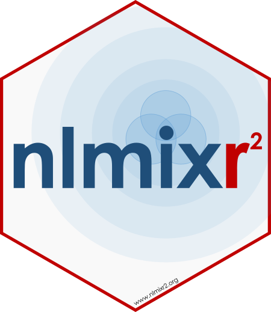

{width=30% fig-alt="The nlmixr2 logo: a hexagonal sticker with a red border featuring nlmix in dark blue and r squared in red, with www.nlmixr2.org along the bottom edge"}

_Original post on the nlmixr2 project blog is [here](https://blog.nlmixr2.org/blog/2026-08-05-nlmixr2-7/)._

The nlmixr2 Working Group continues to expand what open-source R tooling can support in pharmacometrics. In a new release post, Matt Fidler and the nlmixr2 Development Team introduce nlmixr2 7.0 - the release where `focei` finally solves in parallel on all OpenMP-enabled platforms. Along with that, a few defaults changed, so by default `focei` will not give the same numbers it gave in nlmixr2 6. That change is deliberate, and the post explains the motivation and how to restore the older behavior if you need it.

`saem` also changed in ways that made test fits more accurate and more extensible. The post covers new “fast” `focei` variants with analytical population gradients, a more robust SAEM workflow, experimental estimation engines, and a much larger set of ODE solvers in rxode2 - including AutoSwitch composites that fall back from non-stiff to stiff methods when needed.

Read the full post from the nlmixr2 blog: [nlmixr2 7.0](https://blog.nlmixr2.org/blog/2026-08-05-nlmixr2-7/)

## Why nlmixr2?

The vision of nlmixr2 is to develop a R-based open-source nonlinear mixed-effects modeling software package that can compete with commercial pharmacometric tools and is suitable for regulatory submissions.

In short, the goal of nlmixr2 is to support easy and robust nonlinear mixed effects models in R.

From: [https://github.com/nlmixr2/nlmixr2](https://github.com/nlmixr2/nlmixr2)

## Get involved in the nlmixr2 working group

The nlmixr2 working group is open to anyone interested in contributing to the project. You can get involved by:

Main repo: [https://github.com/nlmixr2/nlmixr2](https://github.com/nlmixr2/nlmixr2)  
Issues: [https://github.com/nlmixr2/nlmixr2/issues](https://github.com/nlmixr2/nlmixr2/issues)  
Discussions: [https://github.com/nlmixr2/nlmixr2/discussions](https://github.com/nlmixr2/nlmixr2/discussions)
