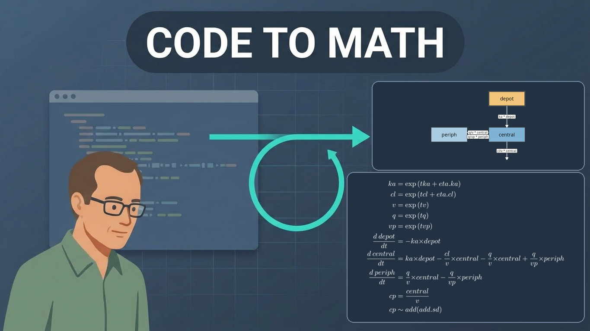

{width=100% fig-alt="Illustration titled Code to Math: model code leads to a two-compartment diagram of depot, central, and peripheral compartments and the matching differential equations"}

_Original post on the nlmixr2 project blog is [here](https://blog.nlmixr2.org/blog/2026-09-29-model-diagrams-equations/)._

The nlmixr2 Working Group continues to expand what open source R tooling can support in pharmacometrics. In a new post, Matthew Fidler shows how the figure and the equations in a report can be generated from the model that was actually fit. `nlmixr2plot` 5.2.0 adds `modelDiagram()`, which reads the `d/dt()` equations and draws the compartment diagram. `nlmixr2extra` turns that same model object into aligned LaTeX equations with `knit_print()`. Because both read the fit, they stay with it when a transit compartment, an effect, or a covariate changes.

That closes a common gap in pharmacometric reports, where the diagram is drawn by hand and the equations are typed separately, then left behind as the model changes. The post covers three diagram engines (`ggplot2`, `DiagrammeR`, and Graphviz DOT), pharmacodynamic arrows whose direction is read from the equation, and one R Markdown file that knits the diagram, the equations, and the parameter table to Word, HTML, and PDF. In the development version of `nlmixr2rpt` (0.2.3), the default Word and PowerPoint reports open with that diagram and those equations.

Watch the 8-minute narrated walkthrough: [https://youtu.be/Jf9QbmuR_Xw](https://youtu.be/Jf9QbmuR_Xw)

Read the full post from the nlmixr2 blog: [Model diagrams and equations, straight from the code](https://blog.nlmixr2.org/blog/2026-09-29-model-diagrams-equations/)

## Why nlmixr2?

The vision of nlmixr2 is to develop a R-based open source nonlinear mixed-effects modeling software package that can compete with commercial pharmacometric tools and is suitable for regulatory submissions.

In short, the goal of nlmixr2 is to support easy and robust nonlinear mixed effects models in R.

From: [https://github.com/nlmixr2/nlmixr2](https://github.com/nlmixr2/nlmixr2)

## Get involved in the nlmixr2 working group

The nlmixr2 working group is open to anyone interested in contributing to the project. You can get involved by:

Main repo: [https://github.com/nlmixr2/nlmixr2](https://github.com/nlmixr2/nlmixr2)  
Issues: [https://github.com/nlmixr2/nlmixr2/issues](https://github.com/nlmixr2/nlmixr2/issues)  
Discussions: [https://github.com/nlmixr2/nlmixr2/discussions](https://github.com/nlmixr2/nlmixr2/discussions)
