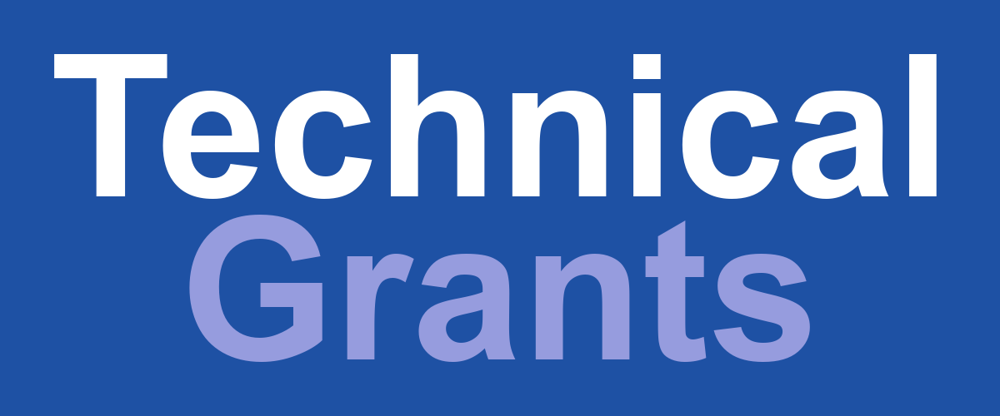

{fig-alt="Graphic with text: Technical Grants on a blue background"}

The R Consortium Infrastructure Steering Committee (ISC) is now accepting proposals for the second technical grant cycle of 2026. The application window opened September 1 and closes October 1, 2026, at 11:59 p.m. US Eastern Time.

R Consortium awards grants that build the technical and social infrastructure of the R ecosystem. Funding supports open-source software, developer tools, and community programs that serve R users and package authors worldwide.

## [Call for Proposals](https://r-consortium.org/all-projects/callforproposals.html)

### Is your project a fit?

The program looks for work that will help a wide R audience, not a narrow user group. Strong proposals have a focused scope, clear deliverables, and low-to-medium risk with value that can be shown. If your idea is large, consider breaking it into a smaller, well-defined first phase.

Past technical grants have supported R-hub for package checking, DBI database backends, packages such as mapview and sf, translations in R, and infrastructure for R on Windows and macOS. Social infrastructure grants have included SatRDays, which helped bootstrap local R conferences.

### What we generally do not fund

ISC grants are not the right path for every request. We generally do not fund projects that affect only small user groups, conference or workshop sponsorship (see the [RUGS program](https://r-consortium.org/all-projects/rugsprogram.html)), highly exploratory research (consider an [ISC working group](https://r-consortium.org/all-projects/isc-working-groups.html)), or hardware and cloud software purchases.

### How to apply

Prepare a 2 to 5 page proposal that describes the problem you want to solve. Use the required [ISC proposal template](https://github.com/RConsortium/isc-proposal), which includes guidance and examples for each section. Save the completed proposal as a self-contained PDF, then submit it through the Google Form on the Call for Proposals page. A Google account is required.

After you submit, you should see a “Thank you for your proposal!” message and receive a confirmation email. If that email does not arrive, check your spam folder and contact us right away. Questions can go to [proposal@r-consortium.org](mailto:proposal@r-consortium.org).

The ISC has a limited grant budget and looks for well-defined milestones, with some initial work already completed to keep delivery risk in check. You are welcome to seek informal feedback from committee members or the broader R community before you submit. A standard consultant agreement is used for all funded projects and is available for review on the Call for Proposals page.

### Key dates for the second 2026 cycle

- September 1, 2026 — application period opens
- October 1, 2026 — applications close, 11:59 p.m. US ET
- November 1, 2026 — the ISC contacts accepted grantees
- December 1, 2026 — deadline to accept the grant and contract; public notification follows shortly after

Grants are paid in two parts: 50% when you sign the contract and 50% when the work is complete. Accepted projects are published on the R Consortium blog.

This is one of two ISC grant windows each year. If you have been building a package, strengthening documentation, improving translations, or designing infrastructure that would help R users everywhere, now is the time to turn that idea into a proposal.

## [Call for Proposals](https://r-consortium.org/all-projects/callforproposals.html)
