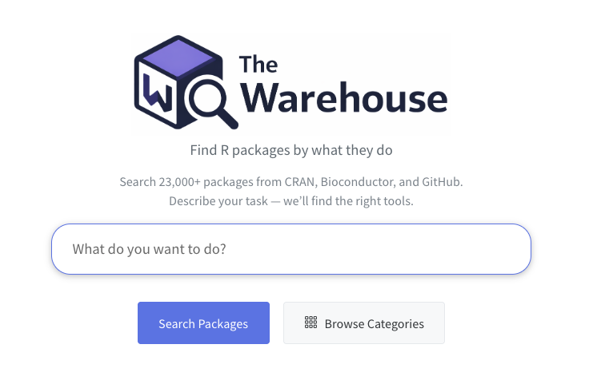
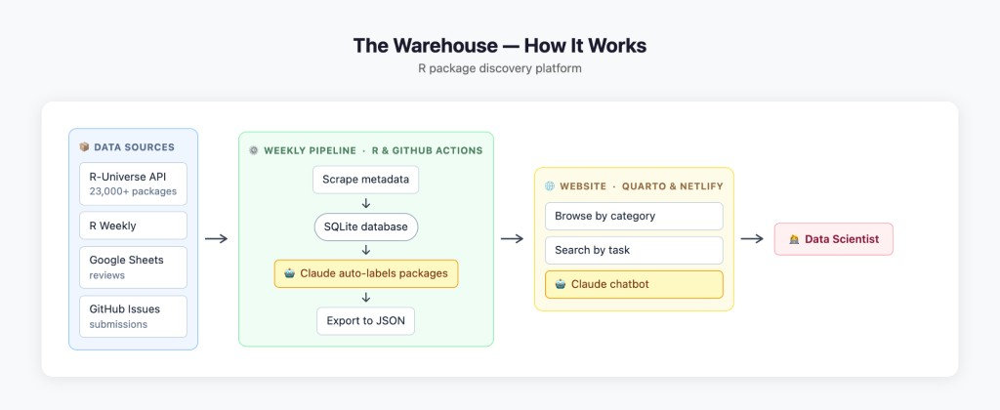
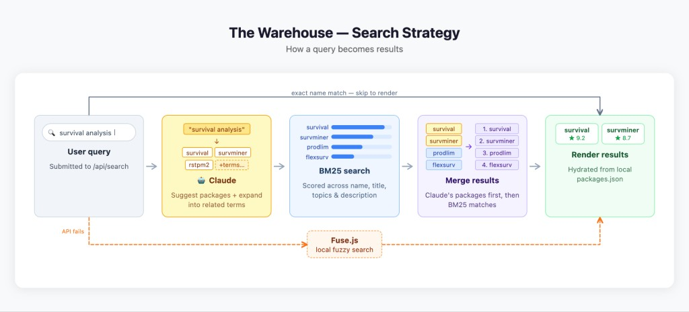

--- 
title: "Searching the R Ecosystem by Function, Not Package Name" 
unpublished: false 
url: "https://r-consortium.org/posts/the-warehouse-searching-r-packages-by-function/"
description: "Kylie Ainslie built The Warehouse, an AI-assisted site that helps users discover R packages by describing what they want to do." 
categories: ["ai", "software development"]
author: "R Consortium" 
image: "thumbnail-warehouse.png" 
image-alt: "The Warehouse homepage — Find R packages by what they do" 
date: "07/08/2026" 
---

With more than 20,000 packages available on CRAN, and thousands more hosted on GitHub and R-Universe, the R ecosystem offers extraordinary depth. But that richness creates a familiar challenge: how do you discover a package when you don't already know its name?

That question led Kylie Ainslie to build [The Warehouse](https://rwarehouse.netlify.app/), a new AI-assisted package discovery site that lets users search for R packages by describing the task they want to accomplish instead of remembering package names or specific keywords.

{fig-alt="The Warehouse homepage with search bar asking What do you want to do?"}

Kylie is Modelling for Policy Lead in the Department of Infectious Diseases at the University of Melbourne, based at the Peter Doherty Institute for Infection and Immunity, and an Honorary Assistant Professor at the University of Hong Kong School of Public Health. Alongside her research in infectious disease modelling and vaccine effectiveness, she develops R packages and open source software that support reproducible research.

{width=50% fig-alt="Kylie Ainslie, Modelling for Policy Lead at the University of Melbourne"}

The idea for The Warehouse came from a problem she encountered herself. Like many R users, Kylie assumed someone had probably already written an R package that solved her problem better than she could. The difficulty lay in finding a package she didn't know existed. "I was of the opinion that someone else has probably made an R package that's far better than I could do myself," she explained. "But if I don't know it exists, how do I find it?"

She began asking colleagues how they discovered new packages. The answers varied widely: reading research papers, recommendations from coworkers, social media, newsletters, or simply hearing about packages through the community. What she didn't find was a consistent way to discover packages based on functionality.

Existing resources such as CRAN and R-Universe already provide excellent information about packages, categories, and repositories. However, Kylie found they generally assume users already know a package name or can search using specific keywords found in package titles or descriptions.

Her solution was straightforward.

"Wouldn't it be nice if you could search for R packages by what they do rather than what they're called?"

That idea became The Warehouse.

## Searching by function

Rather than asking users to search for package names, The Warehouse begins with a description of the task they want to perform.

Someone might search for "interactive plotting," for example, without knowing whether the solution involves ggplot2, plotly, leaflet, or another package entirely.

Behind the scenes, the system expands search terms into related concepts before comparing them against descriptions collected from more than 20,000 packages. 

In some cases, Kylie has also manually mapped concepts to well-known package functionality so relevant packages can still be found even when the exact keywords don't appear in package descriptions.

The Warehouse also extends beyond CRAN. By incorporating packages from GitHub, Bioconductor, and other sources, it can surface useful packages that may never appear in the official CRAN repository but are actively maintained and widely used within particular research communities.

{fig-alt="Diagram of The Warehouse architecture from data sources through weekly pipeline and Quarto website to the data scientist"}

## How AI helps power the search

Large language models also play an important role.

When a user submits a search, Claude assists in two ways: suggests packages likely to match the request and generates expanded search terms and related terminology from the user's request. These expanded search terms are then compared against the package database. A search for "interactive plotting," for example, can be broadened into related concepts and alternative terminology, making it more likely to identify relevant packages.

Because broader searches can easily return hundreds of possible matches, the results are then ranked using established information retrieval techniques, including the BM25 ranking algorithm, to identify the packages that best match the user's intent.

Search isn't the only place in which The Warehouse incorporates AI. The Warehouse also includes a chatbot, powered by Claude, that helps users compare the packages surfaced by their search and decide which is most appropriate for their project. It can even provide code snippets to get users started.

The goal is a search experience focused on functionality rather than exact wording.

{fig-alt="Diagram of The Warehouse search strategy from user query through Claude, BM25 search, merge, and rendered results"}

## Community reviews and package submissions

Search is only one part of the project.

The Warehouse also allows users to submit missing packages and write community reviews.

The idea came from a colleague who suggested users should be able to share their experiences with the packages they use.

"When you want to go to a restaurant, you look at Google Reviews," Kylie said. "Wouldn't it be nice if you could do that for packages?"

Many R packages solve similar problems. Reviews can help users decide which package best fits a particular workflow while also giving developers useful feedback about usability, documentation, or missing features.

Package submissions serve a similarly practical purpose. Although The Warehouse gathers information from multiple sources, there will inevitably be packages that are missed. Users can submit those packages, allowing the directory to become more complete over time.

## Complementing the existing ecosystem

Kylie emphasizes that The Warehouse is not intended to replace CRAN, R-Universe, or other established resources.

Instead, she views it as an additional capability that fills a gap.

CRAN provides curated repositories. R-Universe aggregates extensive package information across CRAN, Bioconductor, and GitHub, and The Warehouse builds on R-Universe's aggregated information. What The Warehouse adds is the discovery layer, helping users find packages based on what they are trying to accomplish rather than what they already know.

## Help shape The Warehouse

Kylie describes the current version of The Warehouse as a prototype. Future development will depend on learning how people use it and what improvements the community would like to see. She can also envision expanding the platform beyond R to support package discovery across multiple programming languages.

If you're an R user, we encourage you to visit [https://rwarehouse.netlify.app/](https://rwarehouse.netlify.app/), try searching for problems you're currently solving, and let Kylie know what works, what doesn't, and what you'd like to see next on [The Warehouse Discussion page](https://github.com/kylieainslie/warehouse/discussions). Whether you discover a package you hadn't seen before, notice a search result that's missing, or have ideas for new features, your feedback will help shape future development. You can also learn more about Kylie and her other open source projects at [https://kylieainslie.github.io/](https://kylieainslie.github.io/).
