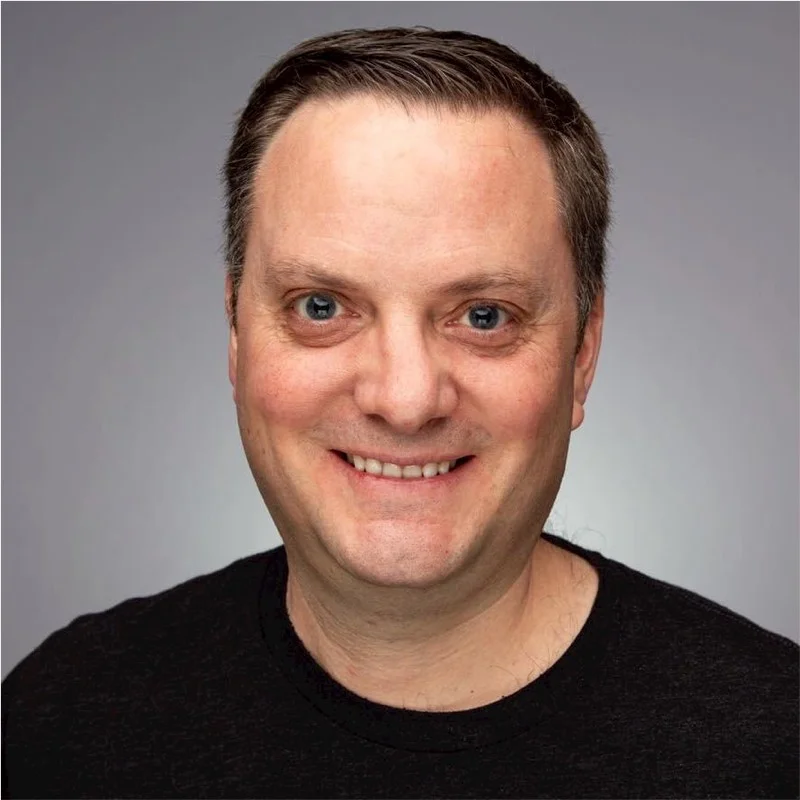
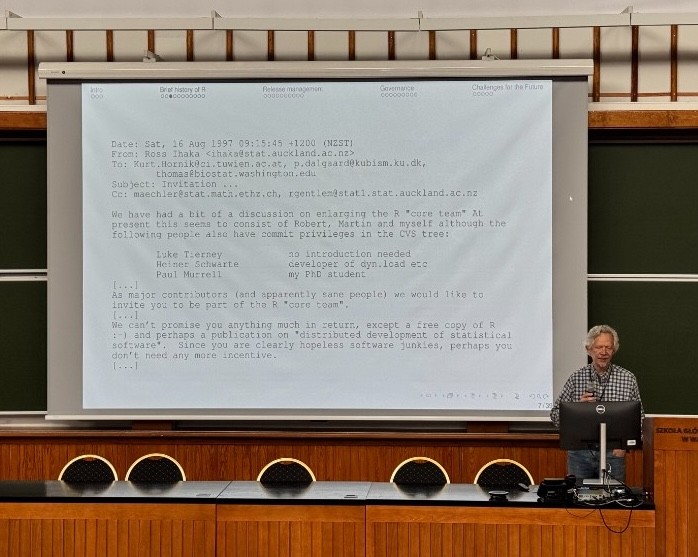
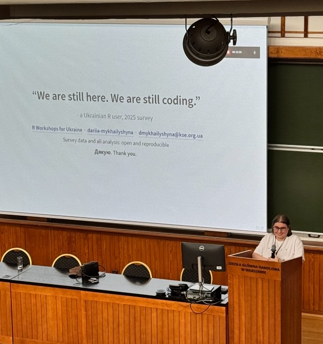
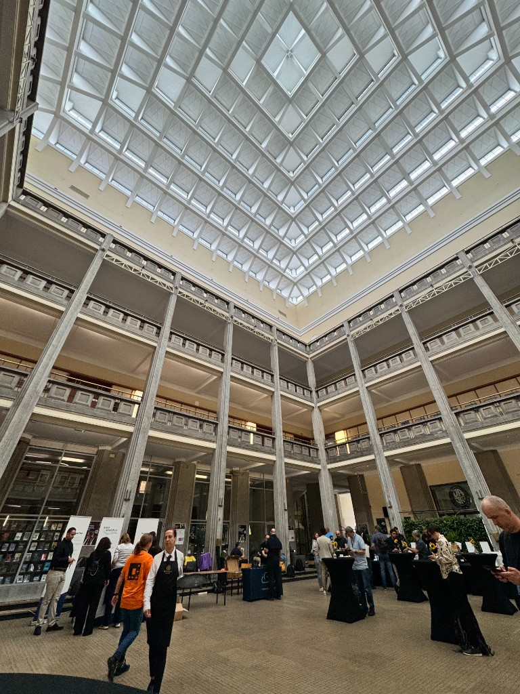
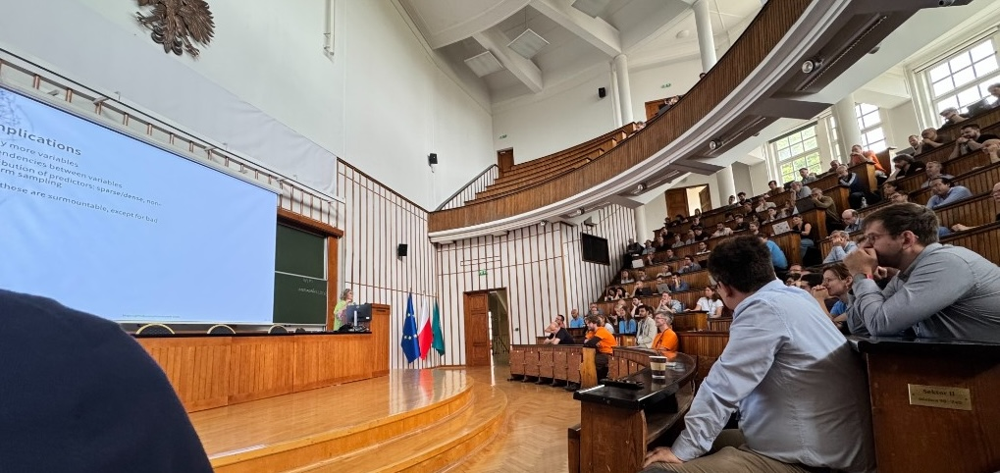
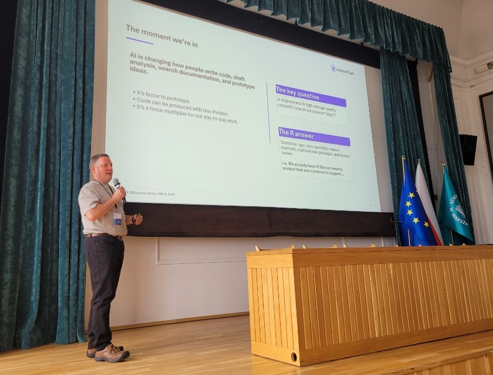
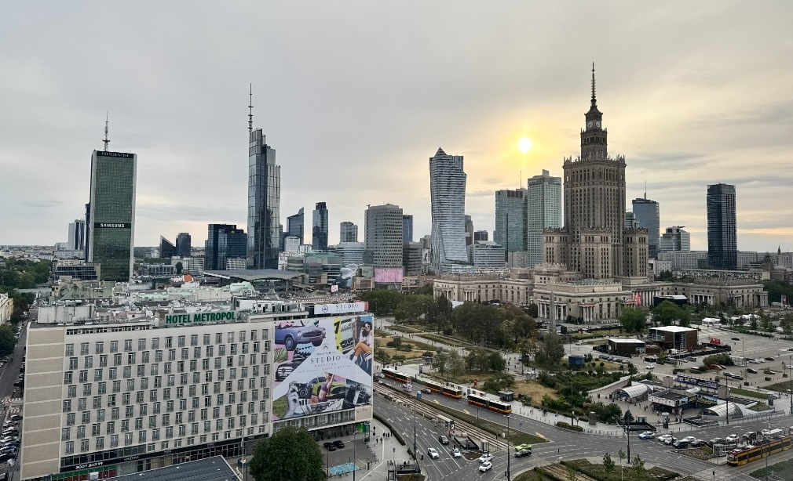
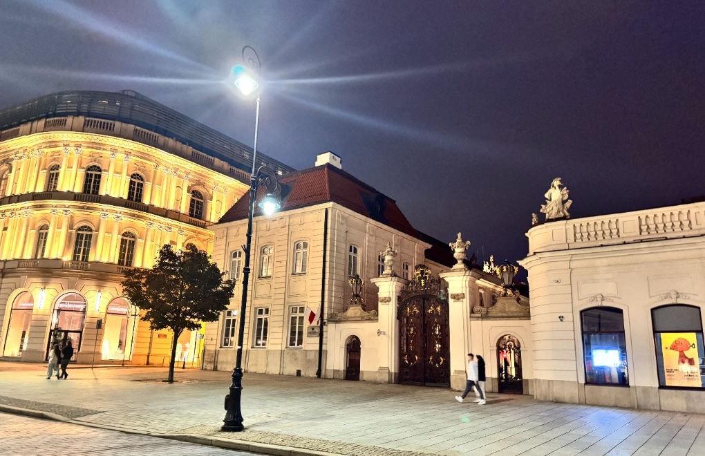
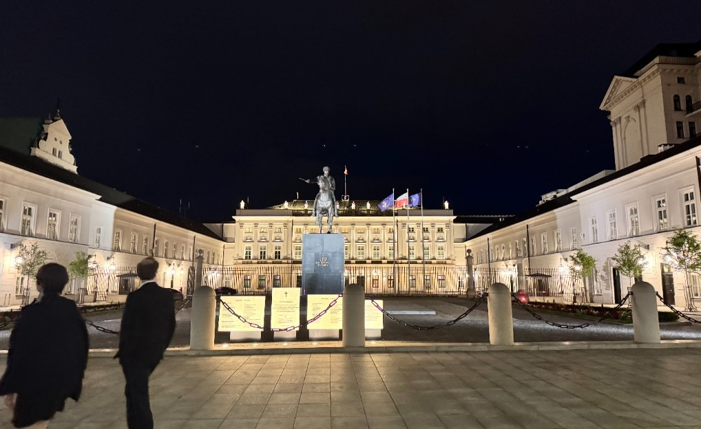

{width=180px style="float: left; margin: 0 1.25em 0.75em 0;" fig-alt="Mike K Smith, Pfizer, R Consortium Board Chair, Silver Member Representative"}

*This blog post is authored by Mike K Smith, Lead, R Centre of Excellence and Senior Director, Statistical Data Science and Analytics, Pfizer, and R Consortium Board Chair, Silver Member Representative. Mike attended useR! 2026 in Warsaw, Poland. The R Consortium was a Platinum sponsor and has enthusiastically sponsored useR! annually. As a Platinum sponsor, the R Consortium also had an opportunity to present. Mike's sponsor session, titled "R is People," stressed the importance of individual people's work and collaboration.*

::: {style="clear: both;"}
:::

---

UseR! 2026 took place during the week of 6th July in Warsaw, bringing together R users from industry, academia and government for several days of learning, discussion and community-building. Hosted by Warsaw Universities, with sessions held at SGH Warsaw School of Economics, the conference offered a warm welcome, a strong technical programme and many opportunities to connect over coffee, lunch and conversation.

{width=60% fig-alt="Peter Dalgaard presenting an overview of R's history, CRAN, the release process and governance"}

Peter Dalgaard gave us an overview of R's history, CRAN, the release process and governance. This was a timely presentation given in the context of the recent [Rousseeuw Prize awarded to the R Project](https://www.rousseeuwprize.org/2026/press-release). I was familiar with parts of this process, but it was valuable to hear "how the cake is made". Evolving a programming language used worldwide, often in business-critical settings, requires care, discipline and a strong instinct to "not break things".

It was encouraging to hear how the R Foundation and R Core are inviting deeper community engagement while strengthening resilience for the future.

The panel on open source software and digital sovereignty broadened that discussion. Digital sovereignty—the ability of nations, or groups of nations, to remain resilient if access to critical digital systems is withdrawn—is a sobering topic. It underlined how open source is not only a technical choice, but also part of a wider conversation about resilience, independence and trust.

Community was another strong theme throughout the conference.

Kari Jordan from The Carpentries gave an engaging talk on building and sustaining resilient communities, reminding us that everyone starts somewhere and that we each have a role in helping others move forward. At a time when AI is prompting questions about the future of data science and programming, her message felt especially important: people still matter. Supporting each other as individuals is something LLMs cannot do.

Dariia Mykhailyshyna from the Kyiv School of Economics offered a powerful example of that resilience through her survey of the R community in Ukraine. Despite the war and the many challenges it has created, Ukrainian data scientists continue to learn, build and support one another through R. Her words captured both determination and community spirit:

"We are still here, we are still coding..."

{width=60% fig-alt="Dariia Mykhailyshyna, Kyiv School of Economics, presenting a survey of R users in Ukraine"}

I arrived in Warsaw not knowing many delegates, but left with new connections, memorable conversations and a renewed appreciation for the breadth and generosity of the R community. My thanks to the organisers, speakers and delegates for a stimulating and welcoming few days.

## Sights from Warsaw

::: {.columns}

::: {.column width="50%" style="padding-right: 0.75rem;"}

{fig-alt="Atrium at SGH Warsaw School of Economics during useR! 2026"}

:::

::: {.column width="50%" style="padding-left: 0.75rem;"}

{fig-alt="Speaker presenting in the lecture hall at useR! 2026"}

{fig-alt="Mike K Smith, Pfizer, R Consortium Board Chair, presenting at useR! 2026" style="margin-top: 0.75rem;"}

:::

:::

::: {.columns}

::: {.column width="33%" style="padding-right: 0.5rem;"}

{fig-alt="View of Warsaw, Poland, location of useR! 2026"}

:::

::: {.column width="33%" style="padding-left: 0.5rem; padding-right: 0.5rem;"}

{fig-alt="Evening street scene in Warsaw during useR! 2026"}

:::

::: {.column width="33%" style="padding-left: 0.5rem;"}

{fig-alt="Presidential Palace in Warsaw at night"}

:::

:::
