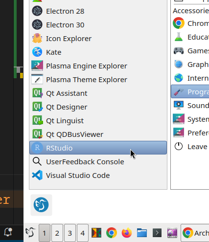
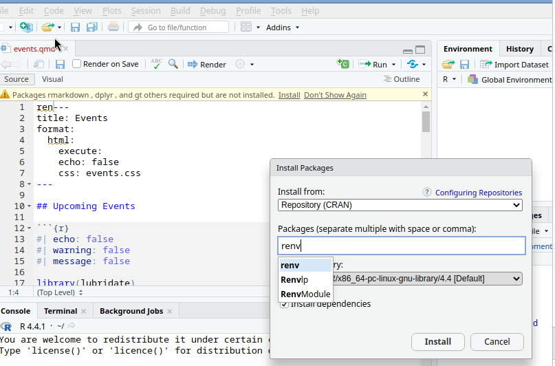
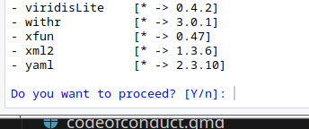
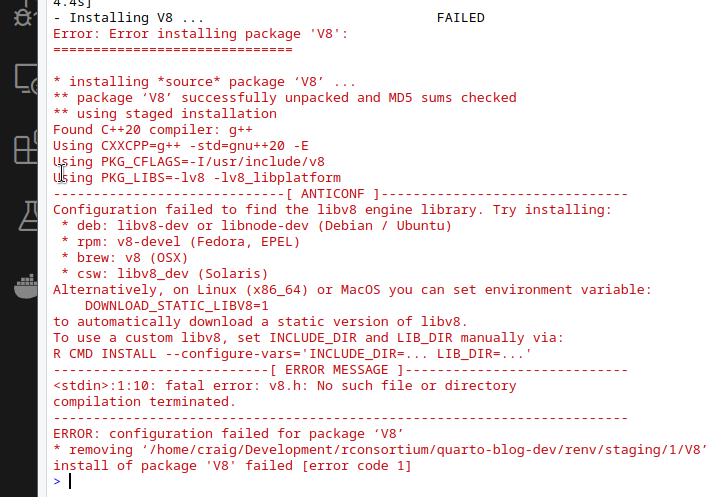
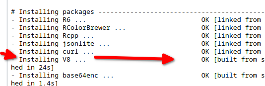
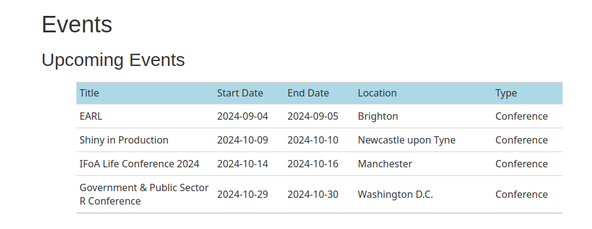

# Install Site Dependencies on Arch Linux

## R Studio

<https://aur.archlinux.org/packages/rstudio-desktop>

Information on Arch Linux AUR is here:

<https://wiki.archlinux.org/title/Arch_User_Repository>

```text
cd src/
git clone https://aur.archlinux.org/rstudio-desktop.git
Cloning into 'rstudio-desktop'...
cd rstudio-desktop/
makepkg -s
Total Download Size:   181.01 MiB
Total Installed Size:  783.31 MiB

:: Proceed with installation? [Y/n] 
```

NOTE: The above `-s` flag will install dependencies.

It also seems to be installing Java, which may cause conflicts
with Android development (or React Native, Flutter).

```text
Packages (12) java-environment-common-3-5  java-runtime-common-3-5
              jre8-openjdk-8.422.u05-1  jre8-openjdk-headless-8.422.u05-1
              libngtcp2-1.7.0-1  nodejs-22.7.0-1  ant-1.10.14-2
              boost-1.83.0-9  jdk8-openjdk-8.422.u05-1  patchelf-0.18.0-3
              wget-1.24.5-3  yarn-1.22.22-2
```

Package completed.

```text
==> Creating package "rstudio-desktop"...
  -> Generating .PKGINFO file...
  -> Generating .BUILDINFO file...
  -> Generating .MTREE file...
  -> Compressing package...
==> Leaving fakeroot environment.
==> Finished making: rstudio-desktop 2024.04.2.764-1 (Wed Aug 28 17:46:26 2024)
[craig@archmini rstudio-desktop]$ 
```

Install

```text
sudo pacman -U rstudio-desktop-2024.04.2.764-1-x86_64.pkg.tar.zst 
```





restore package with renv

```text

> renv::restore()
The following package(s) will be updated:

# CRAN -----------------------------------------------------------------------
- base64enc      [* -> 0.1-3]
- bigD           [* -> 0.2.0]
```



## v8 install



```text
export DOWNLOAD_STATIC_LIBV8=1
[craig@archmini quarto-blog-dev]$ rstudio .
```

At this point, the v8 installed.



possible alternative

<https://aur.archlinux.org/packages/v8-r>

## everything works

gt table now works.


