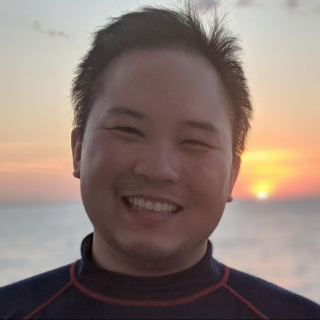

### [Register now!](https://zoom.us/webinar/register/WN_tgEgeRN1SYqCwFfrJ3texA)

Git is a foundational tool for version control in open source collaboration, but 
contributing to a project involves more than just the basics.

In this workshop, you will get a brief introduction to Git fundamentals before 
diving into the workflows used in open source. Contributing as a non-collaborator 
adds an extra layer of complexity, your work needs to be reviewed, which means 
understanding pull requests, branching strategies, and working across forks.

We will start with creating branches and pull requests within your own repositories, 
then extend these concepts to contributing to external projects using forks. Along 
the way, you will learn how tools like the {usethis} R package can simplify and 
streamline this process.

By the end of the workshop, you will be able to fork a repository, make changes 
in a local branch, and submit a pull request to the original project for maintainer review.

## Speaker

### Daniel Chen, Developer Relations, Posit, PBC, and lecturer at The University of British Columbia in the Statistics Department and Master’s of Data Science program

{width=40%}

Daniel has been teaching for the Carpentries, a 501(c)(3) non-profit organization teaching 
foundational coding and data science skills to researchers worldwide, since 2014. He has an 
MPH in Epidemiology and is currently studying data science education in biomedical sciences 
for his PhD. He is an active member in the R, Python, and Carpentries communities and is 
always looking to improve how he teaches programming skills.

[https://daniel.rbind.io/](https://daniel.rbind.io/)

### [Register now!](https://zoom.us/webinar/register/WN_tgEgeRN1SYqCwFfrJ3texA)

## The R Adoption Series

This is a series of webinars focused on the adoption of R. Each session will include a case study 
and often include panels or discussions to enable those starting their journey to ask questions.

R Consortium will [keep this page updated](webinars.html) with information on future webinars in the R Adoption series. 
If there is some information that you are looking for specifically and you don’t see it here, feel 
free to email us at info\@r-consortium.org.
