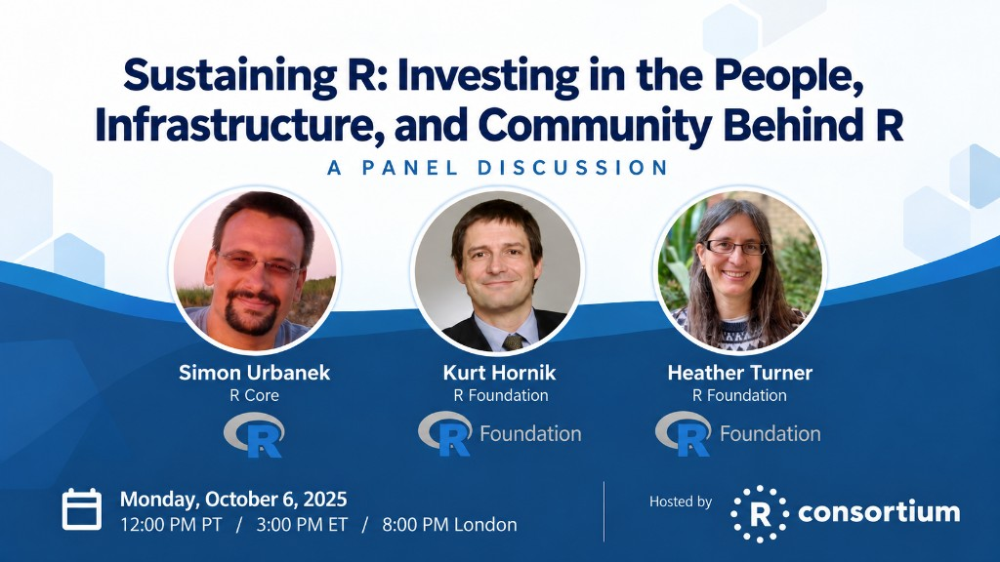

{fig-alt="Webinar banner: Sustaining R: Investing in the People, Infrastructure, and Community Behind R — a panel discussion with Simon Urbanek, Kurt Hornik, and Heather Turner, October 6, 2026"}

## Date and time: October 6, 2026

**12:00 PM PT / 3:00 PM ET / 8:00 PM London**

### [Register here!](https://events.zoom.us/ev/AqzwWaHjkmXdyW9uLSaVzZ6ioYlhesPD4TWjiQ4_a1eAZulSGopf~Au6wzRb4np3MPIE9lja6bKo5gS1KOntUCidM86AuunMcBtVh3SW_iQhXdg)

Join the R Consortium for a panel discussion with **Simon Urbanek** (R Core), **Kurt Hornik** (R Foundation), and **Heather Turner** (R Foundation) on what it takes to keep R healthy for the long term: technical foundations, the next generation of contributors, and the institutions that support the project.

R’s success has created a sustainability challenge. Time-limited grants such as the Sovereign Tech Fund and the Research Software Maintenance Fund are addressing accumulated technical work and expanding the people able to do that work, while recognition such as the Rousseeuw Prize underscores the value of that stewardship. Those investments do not last forever. This session looks at why long-term support still matters, and what the community can do.

## Agenda

* Welcome: why R sustainability matters now
* Sovereign Tech Fund: strengthening R’s technical foundations (Simon Urbanek)
* Research Software Maintenance Fund: building the next generation of R contributors (Heather Turner)
* Rousseeuw Prize: recognition of R as a global public good (Kurt Hornik)
* Sustaining the R Foundation beyond these grants
* Audience Q&A
* Closing: what you can do

## Speakers

### Simon Urbanek

Simon Urbanek is a member of R Core and an Associate Professor in Statistics at the University of Auckland. He has been closely involved in work supported by the Sovereign Tech Fund to modernize R’s technical foundations, including maintainability, supply-chain security, and portability.

### Kurt Hornik

Kurt Hornik is a member of R Core and Vice-President of the R Foundation. He is Professor of Statistics and Mathematics at WU Vienna, where he chairs the Department of Finance, Accounting and Statistics. He has been a principal architect and maintainer of CRAN for more than 25 years. His research focuses on computational statistics, statistical and machine learning, and statistical computing.

### Heather Turner

Heather Turner is a research software engineer and a member of the R Foundation. She co-leads work supported by the Research Software Maintenance Fund to grow pathways into contributing to base R, including contributor infrastructure, mentoring, and community events such as R Dev Days and sprints.

## The R Adoption Series

This is a series of webinars focused on the adoption of R. Each session will include a case study and often include panels or discussions to enable those starting their journey to ask questions.

R Consortium will [keep this page updated](webinars.html) with information on future webinars in the R Adoption series.
If there is some information that you are looking for specifically and you don’t see it here, feel
free to email us at [info@r-consortium.org](mailto:info@r-consortium.org).

### [Register now!](https://events.zoom.us/ev/AqzwWaHjkmXdyW9uLSaVzZ6ioYlhesPD4TWjiQ4_a1eAZulSGopf~Au6wzRb4np3MPIE9lja6bKo5gS1KOntUCidM86AuunMcBtVh3SW_iQhXdg)
